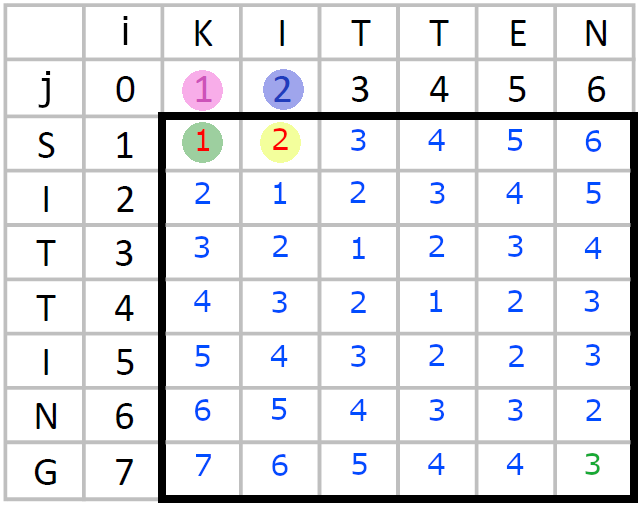

# Project 1-1: CropAlly Maintenance Procedures Manual (MPM)


#### Group 7
#### Authors
 - McKenna Beard
 - Isaac Boodt
 - Tyler Bowen
 - Matthew Bustamente
 - Chandler Garrett
 - Daniel Moreno 

#### Class Details
 - Class Sections
    - CSCE 4901/4905.501: Combined Software Development & IT Capstone I 
    - CSCE 4902/4925.501: Combined Software Development & IT Capstone II
 - Professor: Diana Rabah
 - Start Date: 22 Jan. 2024
 - Projected Finish Date: 13 Dec. 2024


## Table of Contents
1. [Introduction](#intro)
    1. [Purpose of Project](#project_purpose)
    1. [Purpose of MPM & Document Conventions](#mpm_purpose)
    1. [Client Overview & Intended Audience](#audience)
1. [In-Depth System Overview](#indepth_overview)
    1. [Home Page](#indepth_home)
        1. [General Weather Forecast](#weather_forecast)
        1. [Weather Slider](#weather_slider)
        1. [Ambient Weather](#ambient_weather)
        1. [Crop Carousel](#crop_carousel)
     1. [Crops Page](#my_crops_page)
        1. [My Crops](#my_crops)
        1. [Add Crops](#add_crops)
        1. [View Crops](#view_crops)
        1. [Individual Crop](#ind_crop)
    1. [Notebook Page](#notebook_page)
        1. [Background](#notebook_background)
        1. [General Trouble Shooting](#notebook_troubleshooting)
    1. [To-Do Page](#todo_page)
        1. [Background](#todo_background)
        2. [General Trouble Shooting](#todo_troubleshooting)
        3. [Adding Filtering Years](#todo_yearfilters)
    1. [Profile Page](#profile_page)
        1. [Base Page](#base_profile)
        1. [Edit Profile Page](#edit_profile)
        1. [Settings Page](#settings_profile)
        1. [Billing Details Page](#billing_details_profile)
    1. [Data Hub Page](#datahub_page)
    1. [Components & Assets](#components_n_assets)
        1. [Rows & Columns](#grid)
        1. [AppButton Component](#appbutton)
        1. [NavBar Component](#navbar)
        1. [Fonts](#fonts)
        1. [Icons](#icons)
        1. [Colors](#colors)
        1. [Sanitizers](#sanitizers)
        1. [Profile Image Handler](#profile_img_handler)
            1. [What is a URI?](#define_uri)
    1. [Search Bar](#search_bar)
        1. [Background](#search_bar_bkgd)
        1. [Search Bar Component](#search_bar_component)
        1. [Search Function](#search_func)
        1. [Initial String Comparison](#str_comparison)
        1. [Testing the Search Function With Mock Data](#init_search_testing)
        1. [A New String Comparison Function](#new_str_comparison)
        1. [Initial Optimizations](#init_optimizations)
        1. [Sørensen-Dice Coefficient (SDC)](#sdc)
        1. [Damerau-Levenshtein Edit Distance (DLED)](#dled)
        1. [Jaro-Winkler Similarity (JWS)](#jws)
        1. [Transliteration Library](#transliteration)
        1. [Lemmatizer](#lemmatizer)
        1. [Double Metaphone](#double_metaphone)
        1. [Exact String Matching](#exact_str)
        1. [First and Last Letter Section](#1st_last_letter)
        1. [Syllable Counting](#syllables)
        1. [Common Prefix and Suffix](#common_prefix_suffix)
    1. [Backend Services](#backend_overview) 
        1. [Database](#database_overview)
        1. [Backend Server](#backend_overview)
        1. [Writing Endpoints](#writing_endpoints)
        1. [Pushing to the GitHub](#push_to_github_backend)
        1. [User Authentication](#user_authentication)
1. [Installation & Setup](#setup)
    1. [Preparing The Development Environment](#prep_dev_environ)
        1. [Installing Android Studio](#install_android_studio)
        1. [Set Up an Android Emulator](#setup_emulator)
        1. [Installing NPM](#install_npm)
        1. [Installing Expo](#install_expo)
    1. [Package Management](#pkg_mgmt)
        1. [Importing Libraries](#import_libs)
    1. [Running The Program](#run_program)
        1. [Starting Expo Go](#start_expo)
        1. [Starting The Test Suite](#start_tests)
1. [Maintenance Tasks](#maint)
    1. [Maintenance Schedule](#maint_sched)
    1. [Fixing Bugs & Crashes](#fix_bugs_crashes)
    1. [Code Validation](#code_validation)
    1. [Adding a New Page](#add_page)
        1. [The Status Bar](#status_bar)
        1. [Adding Dark Mode](#add_dark_mode)
        1. [Expanding the Navbar](#expand_navbar)
        1. [Importing the Search Bar](#import_search)
    1. [Security Validation](#security_validation)
    1. [Performance & Availability Monitoring](#performance_availability_monitoring)
    1. [Updating the Design & Enhancing Features](#update_designs_features)
    1. [App Compatibility Audit](#app_comp_audit)
1. [Troubleshooting](#trblsht)
    1. [Emulator Errors](#emulator_errors)
        1. [Cannot Open Emulator](#cant_open_em)
        1. [Emulator Says "The system UI isn't responding"](#ui_not_responding)
        1. [Emulator Says "Something went wrong. Can't connect to Internet."](#no_internet)
        1. [Emulator Reloads When I Try to Type 'R' Into an Input Field](#reloads_on_r)
        1. [VT-X/AMD-V is Disabled](#vt-x_disabled)
        1. [Emulator Says "Something went wrong. Sorry about that"](#something_went_wrong)
    1. [Expo Errors](#expo_errors)
        1. [Expo-CLI is Deprecated / Legacy Expo-CLI](#cli_deprecated)
        1. [Expo Keeps Stopping](#expo_stops)
        1. [Android is Disabled](#disabled_android)
    1. [Common React Native Compilation Errors](#rn_compilation_err)
        1. [Error due to Different Number of Hooks Between Renders](#different_number_hooks)
        1. [Computer Restarts When Loading App in Emulator](#computer_restarts)
        1. [Infinite Number of Rerenders](#infinite_rerenders)
        1. [VirtualizedLists Nested In a ScrollView](#nested_virtualizedlists)
        1. [Invariant Violation Error](#invariant_violation)
        1. [Destructuring Issue](#destructuring_issues)
    1. [Jest Errors](#jest_errors)
        1. [General Troubleshooting Advice For Jest](#general_ts_advice)
        1. [No Tests Found](#no_tests)
        1. [Cannot Use Import Statement Outside a Module ](#cant_use_import)
        1. [Unexpected Token](#unexpected_token)
        1. [Unable to Find an Element](#unable_find_element)
        1. [Snap File is Mostly Empty](#empty_snap_file)
        1. [Expected String or Class/Function But Got Undefined](#undefined_not_string_class)
        1. [Error About Act Wrapping](#act_wrapping)
1. [Tools & Resources](#tools)
    1. [General Docs](#general_docs)
    1. [Testing Utilities](#testing_utilities)
    1. [Ambient Weather](#ambient_weather)
1. [Appendices](#appendices)
    1. [Appendix A: Understanding React Native](#react_native)
        1. [File Types](#file_types)
        1. [Class Vs. Functional Components](#component_types)
        1. [Import Types](#import_types)
        1. [Inter-Page Routing](#routing)
    1. [Appendix B: Glossary](#b_glossary)

## Introduction <a name="intro"></a>
### Purpose of Project <a name="project_purpose"></a>
*Author: Daniel, Tyler*

The purpose of CropHero is to provide an accessible, easy-to-use mobile app for small-scale and hobbyist farmers. They should be able to record, track, and visualize crop data including days since planting, height, and other helpful information for growing crops and caring for livestock. The product will also act to aggregate data within the community for better yields and collaboration. 
### Purpose of MPM & Document Conventions  <a name="mpm_purpose"></a>
*Author: Daniel*

The Maintenance Procedures Manual is a formal document that establishes the general structure of the CropAlly application and general procedures to support it in the future. While conciseness is a consideration, rigor and detail is this document’s priority. By doing so, future maintainers and developers can achieve an exhaustive understanding of the CropAlly application. This helps ensure effective support without time wasted as they try to understand their predecessors' efforts. 

It is recommended that developers and maintainers expand the MPM while contributing to the code. This helps to ensure that the MPM is thorough and contains all relevant information. In addition, this can be considered an extension of rubber duck debugging. By explaining the logic behind your code as you write it, you should be able to identify potential problems. 

Each chapter in the document will be marked by a high-level header which will be Level 2. Section headers will be marked by a Level 3 header. Each subsequent header will be marked by a higher level header. Only the top three headers will be included in the table of contents: the chapter, section, and subsection headers. Authorship notes will be put in italics and placed immediately after the header.
### Client Overview & Intended Audience <a name="audience"></a>
*Author: Daniel*

The client is Zina Townley, a current product owner and release train engineer at L3Harris Technologies. Also, she is a former Scrum master, application support manager, IT manager, and programmer analyst. She and her husband created the Ashby-Browning Family Scholarship in Engineering at UNT. Importantly for this application, she is a hobbyist farmer who owns 11 acres. This marks her as a Lifestyle user according to our user class definitions. 

This maintenance manual is meant to help the client and any future developers on this project. The MPM will help the developers to understand the project's structure as they are onboarded. In addition, the MPM will provide details regarding any maintenance tasks, troubleshooting tips, and useful resources for those developers.

## In-Depth System Overview <a name="indepth_overview"></a>
### Home Page <a name="indepth_home"></a>
#### General Weather Forecast <a name="weather_forecast"></a>
*Author: Daniel*

At the top of the Home page is a bar with 7 icons on it and an abbreviated day of the week underneath each icon. Within the page’s functional component is a useEffect hook, the hook that allows for asynchronous requests. First, I call a getGridpoints function which converts a zipcode into gridpoints that can be understood by the National Weather Service’s API. This function checks the passed zipcode against a dictionary that I created. I found the USPS zipcode database and then used a Python script to create a dictionary of lat-long coordinates with the zipcodes functioning as keys. The lat-long coordinates are sent to the NWS API to receive the gridpoints. 

Afterwards, I pass the gridpoints to the NWS API and fetch the weather forecast based on that. If the first forecast date is labelled as This Afternoon, then I store the forecast information for today and the next 6 days in 7 state variables. If the first forecast date is labelled as Tonight, I store the forecast information for 7 days, starting with the next day. Since this is a farming app, this process will always ignore night-time forecasts. Since the API labels the current day as tonight or today, a simple lookup table is used to determine today's name based on tomorrow.

At render, the forecast information and day name are passed to 7 WeatherIcon components. The forecast information gets passed to a function in WeatherTypes.jsx. The function takes the shortened forecast, gets rid of anything after the “then” as that is in the future, and evaluates the text. Unfortunately, the NWS API has never established a standardized list of potential values, much to the annoyance of a lot of people. As such, substantial research was done by Group 7 to determine the general terms that they use and to condense them down into 10 categories: Clear (0-10% cloud coverage), a Few Clouds (10-30% cloud coverage), Partly Cloudy (30-60% cloud coverage), Mostly Cloudy (60-90% cloud coverage), Overcast (90-100% cloud coverage), Rainy, Stormy, Snowy (includes sleet and hail), Misty (includes drizzling and foggy), and Dusty. The terms are combined into enumerations that are treated as regex to evaluate the forecast. This passes the image’s URI from the Icons constant list. Additional details are added to the evaluated result if the forecast includes the terms Slight Chance (0-30% chance), Chance (30-60% chance), or Likely (60-80%). Slight Chance is given an opacity of 0.4 and Chance is given an opacity of 0.7. If any of the chance indicators are found, a black/white percent sign (based on dark mode setting) is added to the forecast icon, and styling is used to ensure that it overlaps with the forecast icon. All of the display is handled by the WeatherIcon component which is based the forecast, day, and dark mode boolean.

#### Weather Slider <a name="weather_slider"></a>
*Author: Daniel*

Below the weather forecast bar, there is a carousel or slider which is used to display various information retrieved from the Ambient Weather API. Specifically, the carousel displays the actual temperature, the feels-like temperature, the wind speed, the rainfall, the humidity, and the soil moisture. All of the data is passed to the carousel as a JSON object.

At its core, the WeatherSlider component uses a PagerView from the `react-native-pager-view library`. The PagerView is then animated with the `react-native-reanimated library` and wrapped in a SafeAreaView component. Within the AnimatedPagerView, I use the map function to create multiple pages for each of entries in the JSON. A FlatList might create an error due to nesting different list types, depending on the page that imports the slider. As such, I chose to use the map function instead, just as I did with the search bar. Below the AnimatedPagerView is a component called PagingDots which displays a simple meatball menu at the bottom of the carousel to indicate which item in the list is currently displayed. This is done with an `onPageScroll` prop which triggers a custom handler function. The handler function alters two variables called `positionSharedValue` and `scrollOffsetSharedValue` which are used to calculate a variable called `scrollX`, a variable that is then passed to the PagingDots component. `positionSharedValue` and `scrollOffsetSharedValue` are shared variables from the `react-native-reanimated` library which hold the states for animated values. When calculating `scrollX`, the input range is `[0, intro_data.length]` and the output range is `[0, intro_data.length * width]` where intro_data is the JSON passed to the component and width refers to the window's width. The interpolater sums `positionSharedValue` and `scrollOffsetSharedValue`, maps the sum to a range that corresponds to the total width of the intro_data items, and clamps the input such that if it exceeds the accepted input range, it is mapped to the highest possible output value to prevent `intro_data.length * width` from ever being exceeded.

The custom page scroll handler function is based on a custom function defined in another file called `usePagerScrollHandler`. The handler use the `GeneralHandler` interface and `GeneralHandlers` type as a parameter. It is based on a useEvent hook which automatically optimizes the code as it waits for the scroll event to be triggered. You'll also see the `worklet` directive which defines the function as a worklet, meaning it's optimized to run on the native/UI thread in Reanimated. This makes animations and event handling more efficient. Basically, all of it allows me to define custom events when the page is scrolled.

The `PagingDots` component uses the map function again to create one dot for every item in the lost. Each dot is a ScalingDot component which is passed any props passed to `PagingDots` that it does not already use. These props are defined in as a type so that I could specify which props existed and their type. While the props are copy-pasted from the ScalingDot file, ScalingDot only works properly with default exports so I could not export the props. The ScalingDot component basically just displays an animated circle with the color, opacity, and size changing based on whether it is the currently selected dot. All of the animated restyling is handled by more interpolation and clamping which function just like above. As one note, there are several lines like `inActiveDotColor: inActiveDotColor || '#347af0'`. This line means that the `inActiveDotColor` prop is used normally but allows the line to default to  '#347af0' when the prop is null.

#### Ambient Weather <a name="ambient_weather"></a>
*Author: Daniel*

While the previous section discusses how the WeatherSlider component functions, this section focuses on how the information is obtained. First, the API key, app key, and device MAC address are fetched from AsyncStorage. If any of those values have not been set (meaning that they are equivalent to null or are zero-length), then the default JSON is used. Since this if block will trigger before the async functions fetch the values, the default JSON provides loading icons. Once the information has been fetched, it is passed to the `fetchWeatherData` function which returns an array. From the array, I retrieve the first entry and then construct the slider's JSON from specific fields. Specifically, I use the temperature in Fahrenheit (tempf), the feels-like temperature (feels_like), the wind speed in mph (windspeedmph), the amount of rain today in inches (dailyrainin), the humidity percent (humidity), and the soil moisture (soilmoisture).

The `fetchWeatherData` function is wrapped by the `rateLimiter` function. The `rateLimiter` function checks whether the last request occurred within the past 1000ms or past 1 second (the maximum rate permitted by Ambient Weather). If the request is too soon, it is ignored and the Promise is resolved to null. Otherwise, the timestamp for the last request is updated, and the original function is called with the original arguments. The `fetchWeatherData` function receives the API key, app key, and MAC address. The function basically wraps an axios call which makes a GET request to Ambient Weather's RESTful API. The API and app keys are passed as params and are required to gain access to the API. The MAC address is passed as part of the URL which targets the data provided by a specific sensor. Without the MAC address, I would need to fetch a list of all sensors associated with that account, determine which ones provide useful information, and extract it.

#### Crop Carousel <a name="crop_carousel"></a>
*Author: Daniel*

The CropCarousel component is far simpler than the WeatherSlider, just calling the Carousel component with a special name and passing over the props. The Carousel component is just a FlatList which renders multiple pressable views, one for each item passed in the JSON object. The Pressable uses the expo-router to push a new page when a user selects a crop.

### My Crops Page <a name="my_crops_page"></a>
#### My Crops <a name="my_crops"></a>
*Author: Isaac*

The initial purpose behind this section is to have the user be able to create, manage, and delete crops that they may have. The user should be able to manage what crops they have and also be able to view and/or edit any relevant information about said crops. This starts with our initial home page, the "My Crops" page. This page is treated mostly just as a navigation tool between two more pages, Add Crops and View Crops. With this, the user should be able to select and press one of two buttons, and that button should connect to the correct page. This is also the page that the user will return to once they are done with either of the two pages, and it contains the navbar to lead to other pages. 

#### Add Crops <a name="add_crops"></a>
*Author: Isaac*

The purpose of this page is to create the crops that will be used and managed by the user. The user will be brought to a page with various fields to put information. They will have to fill out fields for the name, medium, location, type, variety, source, date planted, and more. The HRF number that will be tied to identify the crop is also created using this page, but it is assigned a randomized 6-digit number when the page is first opened. When the user is done filling out all the fields, they may hit the save button located in the top right. The save button will check to make sure every field is filled out, with no blanks. When that is confirmed, it will create an object and send it back to where the rest of the crops are stored, effectively saving the new crop. If failed, the page will prompt to the user that there are fields that are left unfilled, and will not save the object, but rather return to the add crops page so that the user may fill out the remaining fields. The input fields also go through sanitization, which is covered later by Daniel. All this does is ensure that the inputs are valid and nothing malicious or incorrect.

#### View Crops <a name="view_crops"></a>
*Author: Isaac*

The view crops page is used to present all created crops to the user. This is presented through a scrollable list, with each crop being presented. The objects will only show their name, and the way that they are identified in the list is through the created HRF number. The user should be able to scroll through the list and select any crop that they wish to view more information about. On selection (press), the user will be sent to a mimic of the Add crops page where the crop information will be presented in the input boxes. There is current plans to add search and sort functions as well, where the user will be able to search for specific crops and be able to sort crops based on location or name. The purpose for this page is to present every object in an orderly fashion to the user.

#### Individual Crop Page <a name="ind_crop"></a>
*Author: Isaac*

The individual crop page is created from the View Crops page, where the user has selected a crop to view more information about. This page will look very similar to the Add Crops page, with a similar layout and input boxes, where the main difference is that the information is already filled out and the boxes start uneditable. The user will be able to scroll up and down to view all information about the crop that has been selected. On the bottom of the screen the user will be able to see and edit button. This button makes it so that the user may edit the selected crop so that they may change specifics on information. Every field except the HRF number will be editable, and when the edit is done it should change the information about the crop. 

### Notebook Page <a name="notebook_page"></a>
#### Background <a name="notebook_background"></a>
*Author: McKenna*

 The intended purpose of the notebook page is for the user to be able to document daily proceedings as to what has been happening that day on the farm. The user will add in entries via a pop-up modal and will be able to sort entries by month and year. The notebook page is the default page that is displayed when the user selects the notebook icon from the bottom navigation bar. At the top of the screen, two green ovals are displayed that allow the user to swap between the To-Do page and the Notebook page. Within the Notebook page, the user is given filters displayed along the top underneath the page toggles to allow for filtering entries made by the user for better a better viewing experience. All other interactions are initiated with the speed dial located at the bottom right that allows the user to add an entry. The speed dial is further used on a long press of an entry that allows the user to edit, delete, or export the long pressed entry.
#### General Trouble Shooting <a name="notebook_troubleshooting"></a>
*Author: McKenna*

To make sure an entry is selcted for editing, exporting, or deleting, a long press and hold is required for the system to capture the entry as slected. If the user recieves an error that no entry is selected, the user should acknowledge the confirmation and long press the entry once again.

### To-Do Page <a name="todo_page"></a>
#### Background <a name="todo_background"></a>
*Author: McKenna* 

The purpose of the To-Do page is for the user to keep track of tasks that need to be accomplished around their farming/planting environment. The user is able to assign things such as farmer, task type, crop type, icons, and more to the task entry for easy tracking and filtering. The To-Do page is a secondary page that can be accessed when the user selects the Notebook page from the bottom navigation bar and then toggles to the To-Do page by selecting the corresponding green oval at the top left of the screen. At the top of the screen, two green ovals are displayed that allow the user to swap between the To-Do page and the Notebook page. Within the To-Do page, the user is given filters displayed along the top underneath the page toggles to allow for filtering entries made by the user for better a better viewing experience. All other interactions are initiated with the speed dial located at the bottom right that allows the user to add an entry. The speed dial is further used on a long press of an entry that allows the user to edit, delete, mark complete, or export the long pressed entry.

#### General Trouble Shooting <a name="todo_troubleshooting"></a>
*Author: McKenna*

To make sure an entry is selcted for editing, exporting, marking complete, or deleting, a long press and hold is required for the system to capture the entry as slected. If the user recieves an error that no entry is selected, the user should acknowledge the confirmation and long press the entry once again.
#### Adding Additional Filtering Years <a name="todo_yearfilters"></a>
*Author: McKenna*

Should the application need more years added for entry adding and therefore filtering, more years can be added by simply navigating to the years section in the code and adding in addtional years to the list. 

### Profile Page <a name="profile_page"></a>
#### Base Page <a name="base_profile"></a>
*Author: Daniel*

The base Profile page functions as a central hub which allows a user to easily access the several subpages. At the top, there is a green oval which is laid over a Santa Gray background. The oval was created with a larger height than width, a large border radius, and a scaleX transformer. Then, the oval is moved upwards and folded over the top of the screen to create a half-circle. On this oval, I display the user's name and the profile picture. The profile picture uses the UploadImage component in read-only mode, simplifying the process of storing and using the selected image's URI. Below that, there is a button to edit the profile and a grid of buttons, with all of these buttons linking to other pages. These buttons are based on the AppButton component and use AntDesign icons. Only the icons and arrows are buttons, not the text.

#### Edit Profile Page <a name="edit_profile"></a>
*Author: Daniel*

At the top of the page is a Santa Gray oval which is laid over an Irish Green background. On the circle is a back arrow which unwinds the stack and a save button. The save button triggers a specific function which sanitizes the input before saving it to the database or AsyncStorage. Below that, an UploadImage component allows users to select images for their profile picture. Then, there are a bunch of input fields to retrieve the user's name, keys for their Ambient Weather devices, and a new password. The Ambient Weather fields are auto-populated based on the saved values.

The names are sanitized as `noSQL` and `textOnly`. The Ambient Weather API key, App key, and MAC address are sanitized as `noSQL` and `hexCode`.

#### Settings Page <a name="settings_profile"></a>
*Author: Daniel*

At the top of this page is a back arrow which unwinds the stack and the page's title. Then, the page is divided into two Scotch Mist Tan sections: User Preferences and Account Details. User Preferences allows people to set the color mode, the default visibility for crops, and whether push notifications should be enabled. The buttons and their labels are organized by the Grid components. The color mode is controlled by a toggle switch that can set Dark Mode to true, though it technically works by inverting the switch's previous state in the onValueChange function. The default visibility is controlled by a toggle switch and determines whether crops default to a private or public visibility depending on the user's preferences. The push notifications are enabled generally by a toggle switch. When the notification switch is enabled, separate checkboxes are displayed to enable notifications specifically for upcoming tasks and payments.

The Account Details section first allows the user to select the current farmer. The dropdown picker is set to Modal mode to prevent clipping issues and ensures that the full list of farmers can always be displayed. In addition, the addCustomItem prop allows the user to save and select what they have typed in if it isn't already in the list. In the future, the Account Sync button will generate a numeric code or QR code which allows users to sign into their account without needing to enter any information. Then, there are two buttons which redirect to the Terms of Service and Privacy Policy pages. While unnecessary for this project, they would be critical aspects of rolling the app out as a commercial product. Finally, the app's version is a number fetched from the package.json file to reduce how many things would have to be changed with each app update.

#### Billing Details Page <a name="billing_details_profile"></a>
*Author: Daniel*

At the top of the page is a back arrow which unwinds the stack and a save button. The save button triggers a specific function which sanitizes the input before saving it to the database or AsyncStorage. There is another UploadImage component in read-only mode. Then, there is a dropdown box which opens a scrollview box that contains the different subscription models. Afterwards, there are 4 input fields for the user's email, phone number, zip code and state. The zip code is used by the Home page to determine the weather forecast which is why the save function verifies that the zip code is valid.

### Data Hub Page <a name="datahub_page"></a>
*Author: Matthew*

The main functionality of the Data Hub Page is to take a JSON object. Then, using react-native-chart-kit to display relevent graphs about the user's account. This is the page where the user may get a history of their activity on the app. The secondary functionality of the page is to provide a way for the user to export their compiled data to their phone's local storage or posting to Facebook. The graphs are all contained within collapsible sections, or drop downs, that require the user to press to open. There is a search bar that allows the user to specifically input certain kinds of crops and have the graphs display the relevent information about them. The export functionality uses a form of html2canvas to turn the drop down components into a saveable PNG image file.

### Components & Assets <a name="components_n_assets"></a>
#### Rows & Columns <a name="grid"></a>
*Author: Daniel*

The rows and columns defined in the Grid.jsx file are special assets created to improve the dynamic rendering of pages for multiple screen sizes. To use it, you will need to import it using `import { Col, Row } from '../assets/Grid.jsx'`. When you first open the file, you will probably notice that there is a functional component named Column and a constant called Col, the same word that you would import. Since multiple tags were being exported, the default exports technique could not be used, resulting in the multiple names within the Grid.jsx file (Column vs. Col). 

Starting with the Row tag, it can take three props with height being the most important and the only mandatory one. Then, the Row tag wraps all of its contents and children in a special View tag. The View tag has an array of styles with the later styles being able to overwrite the earlier ones. The styles just set up the flexDirection (necessary for it to work), then whatever style was passed as a prop, and finally the height. The height thing works because it will include the value of the prop in the height style value if the height prop contains a value. Look at [this page on conditional rendering](https://legacy.reactjs.org/docs/conditional-rendering.html) for more on that. 

The columns do something similar but use trick favored by this file’s author to dynamically specify a style based on the prop. The special quote character (ASCII 96 or `) ensures that the variables are expanded out before being stored as a string to specify which style should be applied. 

All columns must be placed into a row. All rows must be placed in a grid container which has a style attribute of flex. The value for flex must be the largest sum of all values passed to the `relativeColsCovered` by all of the columns in each row. So long as the sum of all values in a row are less than or equal to the flex value, each column will be given a width based on the percentage of screen that they are given in the `relativeColsCovered` prop. If 3 columns are all given a `relativeColsCovered` value of 1 or all given a 3, each column would take up 33% of the screen’s width. If all but one of the three columns had a value of 1 and the last column had a value of 5, then the earlier columns would take up 14% of the screen, and the last column would take up 71% of the screen. Since Group 7 was most familiar with Bootstrap, most implementations of the Rows and Cols will have a flex value of 12. 

#### AppButton Component <a name="appbutton"></a>
*Author: Daniel*

The AppButton component was created to provide a standardized button component for multiple pages that incorporated both text and icons from several possible libraries. An onPress event can be passed to the button as a prop, along with an opacity prop which affects the button's opacity when selected. The specifiedStyle and backgroundColor props affect the button's appearance with the backgroundColor prop creating a colored container around everything else rather than stylizing the text's style.

Use the icon prop if you want to specify an image in the Icons folder. Use the mci prop if you want to specify an icon from MaterialCommunityIcons. Use the ad prop if you want to specify an icon from AntDesign. You can use [this website](https://icons.expo.fyi/Index) to find the icon strings for MaterialCommunityIcons and AntDesign. Use the associated size and color props to specify the pixel size and color code of the icon.

#### NavBar Component <a name="navbar"></a>
*Author: Daniel*

The NavBar component is used on all of the major pages and allows the user to navigate between the pages. The NavBar is split into 3 rows with 5 columns in each row, 1 column for each major page. The first row is in a separate View component and exists solely to provide the tan circle which juts up from the bar. The second row provides the icons for each page, along with the green circle behind the Home icon. The third and final row provides the text label for each page. Both the icons and the text use the AppButton component to route people to the selected page, preventing issues where the user may click one but not the other.

When the component is called, a prop like `homeSelected` should be specified in it, though it does not require a value. Since these selected props are boolean props, they are automatically set to true if they are specified without a value. That prop tells the component to change the color of the associated page's icon and text.

#### Fonts <a name="fonts"></a>
*Author: Daniel*

All font files must be in the assets/fonts/ folder. Once you have done this, you can use the expo-fonts library to import and use those fonts. After the font is loaded, the assigned font name can be used for the fontFamily field for styling.

~~~jsx
const [fontsLoaded, fontError] = useFonts({
	'Domine-Regular': require('../assets/fonts/Domine-Regular.ttf')
});

if (!fontsLoaded && !fontError) {
    return null;
}
~~~

This code will load the specified fonts with the useFonts hook provided by the expo-fonts library. If the fonts fail to load, the page is not rendered due to the conditional return. Importantly, don't bother to directly load the bold and italic font variants. A font error won't be generated, but a font will not be successfully created which means that the default font will be applied instead. Since the default font is sans-serif, this is easiest to demonstrate with a serif font.

Throughout the CropAlly app, the two standard fonts are Domine (serif) and WorkSans (sans-serif).

#### Icons <a name="icons"></a>
*Author: Daniel*

The entire app uses the Icons dictionary to handle any local images. Each named image can be called as a property which simplifies accessing and passing it. Without this dictionary, images would need to be called locally with the require function and assigned to a variable for it to share the same functionality.

#### Colors <a name="colors"></a>
*Author: Daniel*

The entire app uses a single standardized color palette. The color palette is a JavaScript dictionary with named fields for each color. Use a website like [this](https://colors.artyclick.com/color-name-finder/) to determine the name. We generally preferred paint-like names over standard names as it allows for multiple similar colors since you can't have overlapping names. For example, both ALMOST_BLACK, IRIDIUM, and CHARCOAL can be called dark gray but that would have been confusing. Also, IRIDIUM was selected over Dune, a better match according to the tool, because iridium gives you a sense for the color while dune implies a brown. Each named color is assigned a hex code string which can be called as properties when setting colors with style variables.

#### Sanitizers <a name="sanitizers"></a>
*Author: Daniel*

As of right now, there are two sanitizing functions with the first parameter of each being the string that will be sanitized. They then return the cleaned text string based on the instructions set in the other boolean parameters. Beginning with `cleanText`, this function offers three options: no stopwords, no SQL, and only text. Firstly, it decodes any Unicode characters into their ASCII equivalents before converting it to lowercase to prevent regex issues. Double dashes are always removed, and a whitelist approach is taken to remove any characters other than `[a-z0-9'.@+()\- ]`. If stopwords were removed, then the sanitizer removes any words that are 2 or fewer characters long or are of 35 specific words. Azure MySQL servers use the InnoDB engine which stops any searching attempts when it encounters one of [35 specific stopwords](https://dev.mysql.com/doc/refman/8.4/en/fulltext-stopwords.html). There is also some useful information in [this StackOverflow thread](https://stackoverflow.com/questions/43319480/fulltext-index-match-string-with-period-mysql). These stopwords are defined in a list and then recursively removed which prevents 'bbye' from causing any issues. If SQL was removed, certain especially problematic SQL keywords are recursively removed to prevent multi-level SQL injection attacks like 'ALTALTERER' which triggers SQL injection if the sanitizer is only applied onced. Finally, the text-only option removes everything except letters, the @ symbol, and the period.

The `cleanNumbers` function also has three optional parameters. By default, decimals are allowed which means that dots are only removed if they are not between two digits. However, this can be disabled. By default, negatives are allowed which means that dashes are only removed if there are two of them, if they do not precede a number, and if they are not the first character in the string. These two removals are performed recursively just like the text sanitizer. Finally, the phone parameter is mutually exclusive with the other two parameters, removing everything except numbers, dashes, parantheses, spaces, and the plus sign.

#### Profile Image Handler <a name="profile_img_handler"></a>
*Author: Daniel*

The Profile Image Handler has two modes: read-only and editable. In read-only mode, this component is a basic Image component which either displays the selected and saved image URI or the placeholder avatar image. When editable, this component includes the same Image component to display the selected or placeholder avatar image. The image URI is stored and retrieved from AsyncStorage. An AppButton component with a MaterialCommunityIcon is displayed in the lower-right corner and can be clicked to trigger the UploadModal.

When loaded, the UploadModal is a translucent gray background which obscures the background with a Scotch Mist Tan box in the center. That central box contains 3 buttons with icons from the MaterialCommunityIcons library. The UploadModal takes 5 props which are a boolean to control its visibility and 4 functions defined in UploadImage. The `onBackPress` function will be triggered when the user taps outside of the modal on the translucent gray background and is set to hide the modal. The `onCameraPress` function will be triggered when the user taps the Camera button in the modal. This function passes a prop from UploadImage to the `uploadImage` function, determining whether it will trigger the front/selfie camera or the back camera. In either case, the function will check whether the app has permission to access the camera. If it does not have access, the function will trigger the phone's built-in permission manager to request access only this time or forever. Once permissions are granted, the appropriate camera will be launched. The basic compression and quality level is set to 1 which is the maximum level of quality and minimum level of compression; the default would have been 0.2. To ensure a similar experience across all platforms, the aspect ratio is set to 1x1 for Android as iOs doesn't allow for aspect ratio configuration and locks it to 1x1. Also, editing is enabled which allows the user to crop, rotate, and flip the image after a picture has been taken. The `onGalleryPress` prop of UploadModal calls the `uploadImage` function in gallery mode which is extremely similar but requests access to the gallery and launches the gallery rather than the camera. The quality, aspect ratio, and editing settings are all set to the same option. At the end of `uploadImage` function is a simple statement to save an image if one was chosen. If the user selected an image in the camera or gallery, the image's URI will be saved in the result variable and then passed to the `saveImage` function. I should note that the assets attribute is a list because these functions can be configured to allow a user to select multiple images at the same time. If the system UI elements (camera, gallery, or permissions) are closed without selecting an image, the `canceled` boolean attribute is set to true, and an image is not saved. The `onRemovePress` prop of UploadModal calls the `saveImage` function with an empty string. If anything other than an empty string is passed to it, the `saveImage` function will save the selected URI with a state hook and in AsyncStorage before hiding the modal. If an empty string is passed, the state hook and AsyncStorage key are set to empty strings, meaning that the placeholder image will be used.

##### What is a URI? <a name="define_uri"></a>
*Author: Daniel*

The acronym URI stands for Universal Resource Identifier. URI is an extremely broad term which includes URLs (which are only used by HTTP/HTTPS, FTP, or LDAP traffic like `https://stackoverflow.com/` or `ldap://[2001:db8::7]/c=GB?objectClass?one`), email addresses in a certain format (like `mailto:John.Doe@example.com`), telephone numbers (like `tel:+1-816-555-1212`), and local files (like `file:////something.png`). In the case of the UploadImage component, URI is used to refer to the path to a local file. Namely, it contains the path to the selected profile picture in the phone's local storage. Even if the camera is launched by the app, the picture will not use the space allocated to the app by the system as it will be placed in the phone's image storage.

### Search Bar <a name="search_bar"></a>
#### Background <a name="search_bar_bkgd"></a>
*Author: Daniel*

In several places throughout the app, a search bar is necessary. A user should be able to search for a specific crop by its name or HRFNum. The user will be typing on a mobile keyboard, possibly while wearing gloves. As such, the search bar needs to provide error correction or possible matches for the user's input. This is where fuzzy searching comes into the equation. Fuzzy searching is the usage of one or more algorithms to find strings in the database and suggest it to the user, boosting the relevance of search options. For most cases, substring matches are sufficient which just checks whether the input is present within any database strings. However, this does not allow for error correction, a necessity for this use case. Many companies prefer machine learning approaches because pre-existing solutions can be quickly bought and used. Since this is school assignment, a custom algorithm is necessary, and machine learning is too complex for this situation. Another approach to fuzzy searching is synonym, grammar, and dictionary-based approaches, but those do not work well when searching numbers and names. As such, this left partial word matching, edit distances, similarity coefficients or indices, and n-gram matching. 

The idea of placing the Search Bar section under the Components and Assets section was considered. However, it was decided to make the Search Bar portion into a separate section due to its length and complexity. 

#### Search Bar Component <a name="search_bar_component"></a>
*Author: Daniel*

Before I can discuss how I wrote the search code, I need to briefly cover how React Native works and how I created the search bar component. Technically, React Native is an open-source, client-side UI framework for TypeScript that can be translated into code which works on most mobile devices. Basically, React Native allows you to combine HTML-like tags or components, CSS-like styling, and JavaScript-like functionality. If you want, you can create custom components with either arrow functions or classes that extend React.Component. Each component has props or properties which can be edited like an HTML attribute. 

In accordance with object-oriented principles, I wanted to create a separate component for the search bar that other group members could import. Depending on their page, they either needed the search results to display in a dropdown below the search bar or on a separate page. I chose to implement the separate page option as a modal that opens and covers the view. However, I will leave that discussion here as it is not the primary focus of this post. Also, some pages use ScrollView which prevented me from using the premade solutions for display, like FlatList. I ended up using the .slice() function instead. Also, I initially planned to use the onPress prop but that overrode a pre-existing prop, causing a variety of annoying bugs. A custom handlePress prop was much easier.

To use the search bar component, simply enter `<SearchInput resultDisplayMode={"dropdown"}/>` in your code. If you want to use the modal option, pass "modal" to the resultDisplayMode prop. By default, the search bar will reroute the user to the View Crop page for the selected crop. If that is not the desired result, please pass a handlePress prop like `<SearchInput resultDisplayMode={"dropdown"} handlePress={(crop)=>{console.log(crop); setSelectedCrop(crop)}}/>`. In this example, it will log to  console the full crop JSON object and set a state variable called selectedCrop equal to that crop object.

#### Search Function <a name="search_func"></a>
*Author: Daniel*

This was my first version of the searchFunction and is the reason why I needed to use a class component.  

~~~jsx
searchFunction = (text) => {  
  //clean up the text based on whether or not it is a number 
  var cleanedTxt = "" 
  if (isNumeric(text)) { 
    cleanedTxt = text.cleanNumForSearch(); 
  } else { 
    cleanedTxt = text.cleanTextForSearch(); 
  } 
 
  //sort array in ascending order to place the lowest value at the top 
  const updatedData = this.arrayholder.sort(function(a,b){  
    //if number, check against HRFNumber, otherwise look at name 
    if (isNumeric(text)) { 
      //sort the array in ascending order based on the crop's HRFNumber 
      return compareStrings(a.hrfNum,cleanedTxt) - compareStrings(b.hrfNum,cleanedTxt);  
    } else { 
      //sort the array in ascending order based on the crop's name 
      return compareStrings(a.name,cleanedTxt) - compareStrings(b.name,cleanedTxt);  
    } 
  }); 
  this.setState({ data: updatedData, searchValue: text });  
};  
~~~

Looking back, I can see a lot of issues with this function. However, I want to show the progress along the way rather than simply the final product as that will be too confusing and leave out the reason why I arrived at the final version. In this version, the function checks if the text is primarily numeric before cleaning it and determining whether the user wants to look at the HRFNumber or the crop's name. Then, searchFunction uses a custom comparator to sort the array of crops, placing the crop with the lowest value at the top. 

#### Initial String Comparison <a name="str_comparison"></a>
*Author: Daniel*

Let's take a look at the initial version of the compareStrings function.  

~~~jsx
function compareStrings(s, t) { 
  //get the Sørensen-Dice Coefficient value 
  sdc = sorensenDiceCoefficient(s.toUpperCase(),t.toUpperCase()) 
  //if the SDC is high enough, just return that and skip DLED 
  if (sdc >= 0.45) { 
    return 1 
  } 
  //get the Damerau-Levenshtein Edit Distance value 
  dled = damerauLevenshteinDistance(s.toUpperCase(),t.toUpperCase(), 10) + 0.1 //add 0.1 to ensure that it is always going to be bigger than the SDC 
  return dled 
} 
~~~

At these early stages, the Sørensen-Dice Coefficient was being calculated, providing a mathematical value that reflects the string's similarity on an inclusive range between 0 and 1. If the coefficient is high enough indicating a good match, compareStrings just returns a 1. Otherwise, the function will calculate the Damerau-Levenshtein Edit Distance and returns that. My research had led me to [Aaron Hammond's article for August Schools](https://www.augustschools.com/blog/needles-in-a-haystack-dice-and-levenshtein/) which is what inspired this implementation, though as you'll see, I later realized that I had misunderstood the article. My final implementation with weighted fuzzy searching is closer to what he was talking about. 

#### Testing the Search Function With Mock Data <a name="init_search_testing"></a>
*Author: Daniel*

Initially, I was using a JSON file with 8 entries. My first version of compareStrings managed 100% accuracy for this small sample, but I decided that it was insufficiently representative of the final product. Earlier in the semester, a different professor mentioned that he used Go or Python to quickly generate test cases. 

Based on that, I decided to create my own test cases. First, I found a list of crops grown in Texas on the Department of Agriculture's website. Then, I created a basic Python program to generate JSON entries for each crop and export them to a usable file. Afterwards, I set up some code to randomly assign plausible values for the other fields. Also, I used a function that creates the plural form of a word as the database could have "Blackberry" and "Blackberries". I would like to credit it, but I found the function years ago and have been using it for some time. The pluralizer may not be perfect, but it has always met my needs. 

Since this semester kept me very busy and the program didn't need to be perfect, I just threw it together in about 30 minutes. As an example it has been included here. 

~~~python
import json 
import random 
from datetime import datetime, timedelta 
from re import search, sub 
from types import SimpleNamespace 
 
# Read input file of crop names 
with open('croplist.txt', 'r') as f: 
    lines = f.readlines() 
 
# Initialize crops list 
CROPS = [] 
 
# Function to generate random date between 2015 and 2025 
def random_date(): 
    start_date = datetime(2015, 1, 1) 
    end_date = datetime(2025, 12, 31) 
    days = (end_date - start_date).days 
    random_days = random.randint(0, days) 
    #properly format it into 08/22/2024 or MM/DD/YYYY 
    return (start_date + timedelta(days=random_days)).strftime('%m/%d/%Y') 
 
# Function to pluralize a word 
def pluralize(word): 
    # store some common words that don't change or change in a unique way 
    IRREGULARS = { 
        "child": "children", 
        "foot": "feet", 
        "goose": "geese", 
        "man": "men", 
        "louse": "lice", 
        "mouse": "mice", 
        "die": "dice", 
        "ox": "oxen", 
        "person": "people", 
        "tooth": "teeth", 
        "woman": "women", 
    } 
    SAME_FORM = [ 
        "bison", 
        "buffalo", 
        "deer", 
        "fish", 
        "moose", 
        "pike", 
        "plankton", 
        "salmon", 
        "shrimp", 
        "sheep", 
        "swine", 
        "trout", 
        "tuna", 
    ] 
    # store the common endings for plural worlds 
    ENDINGS = SimpleNamespace( 
        **{ 
            "DEFAULT": "s", 
            "SPECIAL": "es", 
            "SUPERSPECIAL": "i", 
        } 
    ) 
    #store example words for: 
    #words that end in 'o' and must be pluralized to 'oes' 
    ES_OS = ["potato", "tomato", "hero", "echo", "torpedo", "veto"] 
    #words that end in 'f' and must be pluralized to 'ves' 
    F_V_WORDS = ["wolf", "elf", "loaf", "thief", "leaf", "knife", "life", "wife", "calf"] 
    #words that end in 'z' and must be pluralized to 'zes' 
    L_REPEATERS = ["buzz", "fizz", "fuzz", "jazz", "quiz"] 
 
    #make the word lowercase to prevent issues 
    word = word.lower() 
 
    #check for special case words defined above 
    if word in IRREGULARS: 
        return IRREGULARS[word] 
 
    if word in SAME_FORM: 
        return word 
 
    # Some words repeat the last letter in their plural form 
    if word in L_REPEATERS: 
        word += word[-1] 
 
    # Words ending in us -> change us to i 
    if search(r"us$", word): 
        return word[:-2] + ENDINGS.SUPERSPECIAL 
 
    # Words ending in is -> change is to es 
    if search(r"is$", word): 
        return word[:-2] + ENDINGS.SPECIAL 
 
    # Words ending in x, s, z, ch, sh -> add es 
    if search(r"[xsxz]$", word) or search(r"[cs]h$", word): 
        return word + ENDINGS.SPECIAL 
  
    # Words ending in y with a consonant before it -> change y to i and add es 
    if search(r"[^aeiou]y$", word): 
        return word[:-1] + "i" + ENDINGS.SPECIAL 
 
    # Words ending in y with a vowel before it -> add s 
    if search(r"[aeiou]y$", word): 
        return word + ENDINGS.DEFAULT 
 
    # Words ending in o -> add s generally, but add es for ES_OS words 
    if search(r"o$", word): 
        if word in ES_OS: 
            return word + ENDINGS.SPECIAL 
        return word + ENDINGS.DEFAULT 
 
    # Words ending in fe -> change fe to v and add es 
    if search(r"fe$", word): 
        return word[:-2] + "v" + ENDINGS.SPECIAL 
 
    # Words ending in f or ff -> add S, but change f to v for F_V_WORDS 
    if search(r"ff?$", word): 
        if word in F_V_WORDS: 
            return word[:-1] + "v" + ENDINGS.SPECIAL 
        return word + ENDINGS.DEFAULT 
 
    # If all else fails, just add s 
    return word + ENDINGS.DEFAULT 
 
# Generate random media from list of values on the client's farm 
def random_media(): 
    return random.choice(["in ground", "hugel mound", "raised bed", "container", "aquaponic"]) 
 
# Generate random location from list of values on the client's farm 
def random_location(): 
    hugel_mounds = ['Hugel Mound #1', 'Hugel Mound #2'] 
    greenhouses = ['Greenhouse #1', 'Greenhouse #2', 'Greenhouse #3', 'Greenhouse #4'] 
    fields = ['Field #1', 'Field #2', 'Field #3', 'Field #4', 'Field #5'] 
    orchards = ['Orchard #1', 'Orchard #2', 'Orchard #3'] 
    return random.choice(hugel_mounds + greenhouses + fields + orchards + ['Garden patch', 'Yard', 'Cold frame', 'Indoor']) 
 
# Generate random variety from list of plausible values 
def random_variety(): 
    return random.choice(["standard", "beefsteak", "little finger", "green", "black", "tall", "heirloom"]) 
 
# Generate random source from list of plausible values 
def random_source(): 
    return random.choice(["personal cutting", "cutting from friend", "burpee", "johnny's selected seeds", "ferry-morse", "walmart", "home depot"]) 
 
# Generate random yield number between 0 and 5 (2 decimal places) 
def random_yield(): 
    return round(random.uniform(0, 5), 2) 
     
# Function to generate random comments from an array of sentences 
def generate_comments(): 

    #A few of the many examples I created 
    sentences = [ 
        "None.", 
        "Nothing for now.", 
        "This crop is doing exceptionally well." 
    ] 
     
    #Randomly join 1 to 3 of the above sentences together for the comment. 
    num_sentences = random.randint(1, 3) 
    return ' '.join(random.sample(sentences, num_sentences)) 
 
# Iterate through each line in the input file 
for line in lines: 
    # Strip whitespace and split by spaces 
    words = line.strip().split() 
 
    # Generate random values 
    label = ' '.join(words) 
    name = label 
    hrfNum = str(random.randint(1, 999)).zfill(3) #generate 3 digit number with prepended 0s 
    media = random_media() 
    location = random_location() 
    variety = random_variety() 
    source = random_source() 
    yield_amount = f"{random_yield()} kg/ha" #appends the units of kilograms per hectares 
    crop_type = random.choice(['annual', 'perennial', 'biennial']) 
    active = random.choice(['Y', 'N']) 
    indoors = random.choice(['Yes', 'No']) 
    date = random_date() 
    comment = generate_comments() 
 
    # Create crop dictionary for singular form 
    crop_singular = { 
        'label': label, 
        'name': name, 
        'hrfNum': hrfNum, 
        'active': active, 
        'location': location, 
        'variety': variety, 
        'source': source, 
        'date': date, 
        'comments': comment, 
        'indoors': indoors, 
        'type': crop_type, 
        'media': media, 
        'yield': yield_amount 
    } 
 
    # Append singular crop to CROPS list 
    CROPS.append(crop_singular) 
 
    # Generate plural label 
    plural_label = ' '.join(words[:-1]) 
    plural_label = plural_label + ' ' + pluralize(words[-1]).capitalize() 
    plural_label = plural_label.strip() 
 
    # Create crop dictionary for plural form 
    crop_plural = { 
        'label': plural_label, 
        'name': plural_label, 
        'hrfNum': hrfNum, 
        'active': active, 
        'location': location, 
        'variety': variety, 
        'source': source, 
        'date': date, 
        'comments': comment, 
        'indoors': indoors, 
        'type': crop_type, 
        'media': media, 
        'yield': yield_amount 
    } 
 
    # Append plural crop to CROPS list 
    CROPS.append(crop_plural) 
 
# Write output JSON to file 
with open('testCropData.json', 'w') as f: 
    json.dump(CROPS, f, indent=4) 
~~~

When I ran this program, I got 584 JSON entries in the following format; more than enough for my needs.

~~~json
[ 
    { 
        "label": "Abaca", 
        "name": "Abaca", 
        "hrfNum": "935", 
        "active": "Y", 
        "location": "Greenhouse #4", 
        "variety": "heirloom", 
        "source": "home depot", 
        "date": "08/22/2024", 
        "comments": "This crop is doing exceptionally well.", 
        "indoors": "Yes", 
        "type": "perennial", 
        "media": "in ground", 
        "yield": "3.74 kg/ha" 
    } 
] 
~~~

With this done, I could finally test my search bar properly. While decently fast, I discovered that the search bar was only achieving about 60% accuracy. The most common issue was with plurals where a user input of "carrots" would always return "carrot" above "carrots". Another issue that I remember is "abaca" being considered a better match than "cabbage" for a user input of "cabba". As such, I began more extensively researching fuzzy searching and approximate string matching. 

#### A New String Comparison Function <a name="new_str_comparison"></a>
*Author: Daniel*

At this point, I discovered an [article on ForrestTheWoods' blog](https://www.forrestthewoods.com/blog/reverse_engineering_sublime_texts_fuzzy_match/) about Sublime Text's fuzzy search algorithm. Sublime Text uses their algorithm to suggest keywords to programmers as they type. According to him, Sublime Text tries to match each character in the user's input and assigns a bonus to the match score for specific characters that are worth more points. Then, the algorithm returns the match with the highest final score. Based on some other blogs I found, I decided that it was still a good idea to combine multiple algorithms but as part of a weighted fuzzy search. Also, I found that multiple algorithms would decrease the likelihood of encountering the [birthday paradox](https://pudding.cool/2018/04/birthday-paradox/), though my use case helped to further reduce this potential problem. All of this led to another version of compareStrings and a change to searchFunction to place the strings with the highest score at the top of the list. 

As denoted by the PROFILING comments, the function can now by broken up into general sections. Preprocessing removes Unicode characters with a transliteration library, changes all letters to uppercase, checks for an exact match which permits an early return, and stores each string's length. The Sørensen-Dice Coefficient (SDC) section calculates the coefficient, multiplies it by 100, rounds it to the nearest integer, and makes that the initial match score. The First and Last Letter section gives a bonus score if the first letter, last letter, or the letters after each space matches. The Length & Syllable section gives a bonus if the two strings are the same number of syllables and a penalty if a different length. The Prefix Match section provides a bonus if the second string starts with the first string. The Damerau-Levenshtein Edit Distance (DLED) section compares the two strings, though I also use it earlier in the First and Last Letter section. The Jaro-Winkler Similarity (JWS) section provides a bonus based on the strings' similarity with an extra bonus for matching prefixes. The final two sections lemmatize the two words, retrieve approximate phonetic encodings for the new words, and then provide a bonus if the encodings match. In a later section, I will explain what all of these terms mean. 

#### Initial Optimizations <a name="init_optimizations"></a>
*Author: Daniel*

If you know anything about these algorithms, you will be unsurprised to hear that this code generally took 5 or 6 seconds every time that the user's input changed and that time only grew as the user's input became longer. As such, I began making various optimizations throughout the code. 

Firstly, I initiated an early return if both strings are identical. Next, I took all of the conditionals out of the `.sort()` function in `searchFunction`. While this means that the code is less clean, it significantly decreases the number of operations and function calls. Then, I removed `isNumeric` and changed the conditional to check whether the first character is a number. Also, I added a variety of early returns from each algorithm if the match score is ever too low. 

Somewhere online, I read that TypeScript offers a more efficient version of function declarations. Despite my best efforts, I have been unable to find the article, but I decided to change all of my function declarations in case they were right. For example, the `compareStrings` function declaration now looks like `this["compareStrings"] = function(s, t)`. Similarly, I created custom versions of any functions that I used from the Math library. From what I saw online, the compiler does a better job of optimizing local code rather than library functions. In addition, this offers the option of bitwise and ternary operators. 

#### Sørensen-Dice Coefficient (SDC) <a name="sdc"></a>
*Author: Daniel*

Let's hop straight into this with the Sørensen-Dice Coefficient. The technical definition is the quotient of similarity over sets or twice the intersection of two discrete sets (the intersection of two) divided by the sum of the number of elements in each set. A result of 1 indicates a perfect match while a 0 indicates a failed match. Also, it is a distance semimetric as it does not satisfy a triangle inequality, rendering 1 minus the coefficient mostly meaningless.

```math
SDC = \frac{2\left|X\bigcap Y \right|}{\left| X\right| + \left|Y \right|}
```

For our purposes, I prefer to define it as the percentage of identical n-grams between two strings, displayed as a floating point number between 0 and 1. The n-grams are overlapping substrings or character blocks into which the strings are divided. Basically, n-gram algorithms, like SDC, break strings down into tokens of a specific length, allowing it to index several characters in a larger string. With regard to the above equation, the array of n-grams for string s is set X, and the array of n-grams for string t is set Y. A smaller n-gram length will focus on the two strings having the same letters while a larger n-gram length shifts the focus to the order of the characters. I found that an n-gram length of 2 (or a bigram) is ideal for my purposes. As an example, the string of "MMRV" has 3 bigrams which are "MM", "MR", and "RV". 

I ended up using an implementation called [Fast Dice Coefficient by Ka-weihe](https://github.com/ka-weihe/fast-dice-coefficient). Unlike most implementations, this one has a time complexity of O(N) or specifically O(len(s) + len(t)) with s and t being the strings passed to the function. When I added it to my file, I made some minor changes to handle specific edge cases that I encountered and to add some comments. 

First, the algorithm goes through some conditional early returns which help to handle edge cases and speed up execution. According to the formula, the function should return 1 if it cannot evaluate the strings. For my use case, I decided to instead return a 0 or 0.11. Then, I store each string's length which also helps to decrease the execution time as the length does not need to be repeatedly retrieved from the string variables. Next, I define a map to store various key-value pairs of 2-character n-grams or bigrams. Then, a second for loop counts the number of bigrams in common between the two strings, relying on basic set theory principles. Finally, it calculates two times the number of matches divided by the sum of the lengths minus two. Without multiplying by 2, the function would divide the number of elements in common by the average size of the sets resulting in half of the value that it should return. An example of needing the multiplication factor would be when the two sets were identical as this would otherwise return a 0.5. Subtracting 2 is unique to this implementation to account for n-gram length and the fact that it slightly overcounts. 

#### Damerau-Levenshtein Edit Distance (DLED) <a name="dled"></a>
*Author: Daniel*

Damerau-Levenshtein Edit Distance is a string metric that conveys the minimum number of operations necessary to transform string s into string t. Standard Levenshtein Edit Distance considers the number of deletions, insertions, and substitutions necessary. The Damerau component adds the potential for transpositions, allowing it to consider the possibility of two neighboring characters being entered in the wrong order. Due to the performance savings, I am using the restricted version where there is a maximum edit distance after which the algorithm should stop. This decreases the time complexity from O(len(s)²) to O(len(s)*maxDistance) where s is the first passed string. The math for all of this is fascinating so let's explore it a bit.

```math
lev(a,b)=\left\{\begin{matrix}
\left| a\right| & \textrm{if} \left| b\right| = 0  \\
\left| b\right| &  \textrm{if} \left| a\right| = 0 \\
lev(tail(a),tail(b)) &  \textrm{if head(}a\textrm{)=head(}b\textrm{)}  \\
1+min\left\{\begin{matrix}
lev(tail(a),b) \\
lev(a,tail(b)) \\
lev(tail(a),tail(b))
\end{matrix}\right. & \textrm{otherwise} \\
\end{matrix}\right.
```

This is the math for a recursive version of Levenshtein Edit Distance. Basically, if either of the strings has a length of 0, the function returns the length of the other string. Tail(x) returns all but the first character of x while head(x) returns only the first character of x. As such, the third line means that if the first character of each string matches, the function should be recursively called on the rest of the strings. The fourth line is a piecewise function that returns a value of 1 plus the minimum of the next three recursive functions which handle deletion, insertion, and substitution in that order. However, recursive functions are terribly inefficient so I used the matrix-based version. 

```math
lev(a,b)=\left\{\begin{matrix}
\left| a\right| & \textrm{if} \left| b\right| = 0  \\
\left| b\right| &  \textrm{if} \left| a\right| = 0 \\
min\left\{\begin{matrix}
lev_{a,b}(tail(a),b)+1 \\
lev_{a,b}(a,tail(b))+1 \\
lev_{a,b}(tail(a),tail(b))+1_{a_{i}\neq b_{j}}
\end{matrix}\right. & \textrm{otherwise} \\
\end{matrix}\right.
```

You can still recognize the length checks. However, the function definition for lev has changed a bit. The values 'a' and 'b' still represent the two strings while 'i' represents the terminal character position of a and 'j' represents the terminal character position of b. Since we are dealing with lengths, the position variables of i and j are 1-indexed rather than 0-indexed. There is a conditional on that final +1 which means that the edit number is only incremented if the character at position i in string a is not equal to the character at position j in string b. However, the math is a bit abstract so let's look at an example. Here's the completed example matrix if a="sitting" and b="kitten" 



*Example variable values: a=sitting; b=kitten; i=1; j=1;*

```math
lev(i,j)=\left\{\begin{matrix}
{\color{Red}\left| a\right|} & {\color{Red}\textrm{if} \left| b\right| = 0}  \\
{\color{Red}\left| b\right|} &  {\color{Red}\textrm{if} \left| a\right| = 0} \\
min\left\{\begin{matrix}
lev_{a,b}(0,1)+1=1+1=2 \\
lev_{a,b}(1,0)+1=1+1=2 \\
lev_{a,b}(0,0)+1_{a_{i}\neq b_{j}}=0+1=1
\end{matrix}\right. & =1 \\
\end{matrix}\right.
```

This is the piecewise function to calculate the red '1' in the green circle. I have substituted in i and j and marked the invalid conditions as red. The function calls lev(0,1) or lev(1,0) will return 1. When plugged into the equations and then sent through the min function, a result of 1 is returned and placed in the matrix. 

*Example variable values: a=sitting; b=kitten; i=1; j=2;*

```math
lev(i,j)=\left\{\begin{matrix}
{\color{Red}\left| a\right|} & {\color{Red}\textrm{if} \left| b\right| = 0}  \\
{\color{Red}\left| b\right|} &  {\color{Red}\textrm{if} \left| a\right| = 0} \\
min\left\{\begin{matrix}
{\color{CornflowerBlue} lev_{a,b}(0,2)}+1=2+1=3 \\
{\color{Green} lev_{a,b}(1,1)}+1=1+1=2 \\
{\color{Magenta} lev_{a,b}(0,1)}+1_{a_{i}\neq b_{j}}=1+1=2
\end{matrix}\right. & =2 \\
\end{matrix}\right.
```

This is the piecewise function to calculate the red '2' in the yellow circle. I have substituted in i and j and marked the invalid conditions as red. The function calls are color-coded with the circles in the matrix. The blue lev(0,2) returns the value in the blue circle which is 2. The green lev(1,1) returns the value in the green circle which is 1. The pink lev(0,1) returns the value in the pink circle which is 1. All of that is plugged into the values so that the minimum can be returned and stored in the matrix. 

*Example variable values: a=sitting; b=kitten; i=7; j=6;*

```math
lev(i,j)=\left\{\begin{matrix}
{\color{Red}\left| a\right|} & {\color{Red}\textrm{if} \left| b\right| = 0}  \\
{\color{Red}\left| b\right|} &  {\color{Red}\textrm{if} \left| a\right| = 0} \\
min\left\{\begin{matrix}
lev_{a,b}(6,6)+1=2+1=3 \\
lev_{a,b}(7,5)+1=4+1=5 \\
lev_{a,b}(6,5)+1_{a_{i}\neq b_{j}}=3+1=4
\end{matrix}\right. & =3 \\
\end{matrix}\right.
```

This is the piecewise function to calculate the green '3' in the bottom right corner. I have substituted in i and j and marked the invalid conditions as red. Like the other functions, each function call returns the value at the specified location in the matrix so 2 for lev(6,6), 4 for lev(7,5), and 3 for lev(6,5). These retrieved values are incremented and sent through the min function to arrive at a final value of 3 which is stored in the bottom-right-most cell. This is the cell that will be returned as the final edit distance. 

Now, my optimizations have changed the original math a bit. Normally, the edit distance cannot be less than the absolute value of the difference between the length of the two strings, but my optimizations take it a bit further by establishing a maxDistance. Firstly, I can return the length of string a early if i = j and the cell at [i][j] is greater than 4. Secondly, I can ignore all cells in the matrix where |i-j| > maxDistance. This also saves me some space as I only need a matrix of len(a) by 2*maxDistance. Thirdly, I return early if the smallest value in the column ever exceeds the maxDistance. Also, I want to note that the +1's would be replaced with my variable costs. Now that I've covered Levenshtein Edit Distance, let's add Damerau's portion. 

```math
dled_{a,b}(i,j)=\left\{\begin{matrix}
\left| a\right| & \textrm{if} \left| b\right| = 0  \\
\left| b\right| &  \textrm{if} \left| a\right| = 0 \\
dled_{a,b}(i-1,j)+1 & \textrm{if } i > 0 \\
dled_{a,b}(i,j-1)+1 & \textrm{if } j > 0 \\
dled_{a,b}(i-1,j-1)+1_{a_{i}\neq b_{j}} & \textrm{if } i,j > 0 \\
dled_{a,b}(i-2,j-2)+1_{a_{i}\neq b_{j}} & \textrm{if } i,j > 1 \textrm{and} a_{i}=b_{j-1} \textrm{and} a_{i-1}=b_{j}
\end{matrix}\right.
```

This looks the same as the LED piecewise with the length conditionals being followed by deletion, insertion, and substitution in that order. The new line with i-2 and j-2 describes the transposition of 2 neighboring characters. 

Importantly, I am using the optimal string alignment version of the DLED algorithm which means that the triangle inequality does not hold. I prefer this version as it does not permit multiple operations on the same substring. For example, it will return an edit distance of 3 for "CA" and "ABC" as a transposition of "CA" → "AC" would not permit a second operation of "AC" → "ABC". Instead, the shortest string of operations for equivalent operation costs of 1 would be "CA" → "A" → "AB" → "ABC". Restricted edit distance is the alternative to optimal string alignment distance and does not have this restriction, but I felt that it was less useful for my purposes. 

Normally, subCost, insertCost, and deleteCost would all equal 1. In some implementations, this is tuned to favor deletions with a cost of 1, then substitutions and transpositions with costs of 1.5, and finally insertions with a cost of 2. I decided to modify this approach. Insertions, deletions, and transpositions are unconnected to any other characters. However, the substitution costs are dependent on the distance between the two keys where one character is replaced with another. As such, I defined a dictionary where I assigned coordinates to each key based on a 2d Cartesian coordinate system. Then, I calculated the Euclidean Distance between those two coordinates for the two passed characters. Since the Euclidean Distance will inclusively range between 0 and 9, I divide it by 3 which ensures that the substitution cost is never too big. In addition, it minimizes the difference between the distance between 'Q' and 'E' versus 'Q' and 'Z' while retaining the difference as one is horizontal while the other is diagonal. 

There are some optimizations that I made to the DLED algorithm. If one string is a prefix to the other, then I can just return the difference between their lengths. Similarly, I’ll return 0 if the strings are identical. If the first string is longer than the second string, I swap them as the first string has a bigger impact on the number of operations. If the two current characters are the same, I use the jagged distance rather than recalculating it. I pass two modified strings to the DLED algorithm where I have removed any shared prefix or suffix. Since the shared prefix and suffix won’t impact the distance, I can simply ignore them. 

Despite all of that math, you just need to know that the DLED algorithm calculates the number of changes necessary to transform one string into another. Since it does not depend on the presence of specific pairs like bigram SDC, DLED is more resilient to typos and overlapping patterns. As such, SDC tends to be more accurate with more substantial errors and for longer text while DLED is more accurate when there are fewer errors in shorter strings. 

#### Jaro-Winkler Similarity (JWS) <a name="jws"></a>
*Author: Daniel*

Jaro-Winkler Similarity is a string metric that uses a normalized value between 0 and 1 to measure the edit distance between two strings. Jaro-Winkler Similarity does not obey the triangle inequality which invalidates it as a mathematical metric. Despite the name, Jaro-Winkler Distance (1 - JWS) is also not a metric since it does not obey the triangle inequality and does not satisfy the identity axiom d(x,y) = 0 ↔ x = y. 

```math
\textrm{Jaro}=\left\{\begin{matrix}
0 & \textrm{if } m=0  \\
\frac{1}{3}(\frac{m}{\left| a\right|}+\frac{m}{\left| b\right|}+\frac{m-t}{m}) & \textrm{otherwise} \\
\end{matrix}\right.
```

The variables 'a' and 'b' represent the strings being compared while 'm' represents the number of matches and 't' represents the number of transpositions. 

The number of transpositions is the number of matching characters that are in the wrong order, divided by two. Two characters are considered matching only if they are the same and not farther than a certain number of characters apart. This maximum distance is calculated using the following equation. 

```math
\textrm{distance}=\left \lfloor \frac{max(\left| a\right|,\left| b\right|)}{2}\right \rfloor - 1
```

This is the length of the two strings sent through the max function before being divided by 2 and sent through a floor function. Finally, 1 is subtracted from it. 

Examples make everything clearer so let's calculate the Jaro Similarity for "FAREMVIEL" and "FARMVILLE". The maximum distance for the matches would be max(9,9)=9 as both are 9 characters long before being divided by 2 for 4.5. The floor of 4.5 is 4, and the final result for the maximum matching distance is 3 after 1 is subtracted from it. Three characters ('F', 'A', 'R') are in the same position in both strings and 5 characters ('M','V','I','E','L') are within 3 characters of each other. The 'E' and 'L' in "FAREMVIEL" are matching characters that are in the wrong order so the number of transpositions is 1. 

```math
\textrm{Jaro}=\left\{\begin{matrix}
0 & \textrm{if } m=0  \\
\frac{1}{3}(\frac{8}{9}+\frac{8}{9}+\frac{8-1}{8})=0.88 & \textrm{otherwise} \\
\end{matrix}\right.
```

The Winkler portion uses a prefix scale (p) to provide more favorable ratings to strings that match from the beginning for a common prefix length up to a maximum of 4 characters. The maximum will be 'L' and the actual length of the common prefix will be 'l'. To prevent the normalized similarity from exceeding 1, the prefix scale should not exceed 0.25 or 1 divided by the maximum allowed prefix length (L) which is generally 4. The standard p-value is 0.1, but I found that 0.16 is the best scaling factor for my purposes. The JWS score can be calculated with the following equation. 

```math
\textrm{JWS} = \textrm{Jaro} + min(L,l) * p * (1 - \textrm{Jaro})
```

Let's continue our example from before. I'll be using 0.16 for my p value and 3 for my l value since both strings start with the same 3 characters. 

```math
\textrm{JWS} = 0.88 + min(4,3) * 0.16 * (1 - 0.88)
```

Now that I've explained how it works, let's discuss the actual code. I heavily optimized the function based on [Miguel Serrano's C-based implementation](https://github.com/miguelvps/c) and [Lars Garshol's Java-based implementation](https://github.com/larsga/Duke) which was based on William E. Yancey's paper called "Evaluating String Comparator Performance for Record Linkage". Also, I added a min_score parameter where the function will return prematurely if that score is impossible to achieve for these string lengths. The final time complexity is O(len(s)*len(a)) where s and a are the strings passed to the function. 

#### Transliteration Library <a name="transliteration"></a>
*Author: Daniel*

Before using any of the other techniques, I ran the text through a transliteration library called Unidecode which transforms Unicode into ASCII. For example, 'á' will become 'a', and '間' will become 'Jian'. Like most transliteration libraries, Unidecode conducts context-free character-by-character mapping which makes it very effective at simply stripping diacritics like accents or transliterating Latin-based languages like Cyrillic characters. While it can translate languages not derived from Latin, it does struggle with some of the details. For example, the common Japanese name of "洋子" can be pronounced as "Yoko" or "Hiroko", and the name of "الرشید عبد" can be accurately transliterated as "Abdal-Rachid" or "Ar-Rashid". Unidecode specifically does not detect the difference between Japanese and Chinese characters as the languages use the same characters to mean different things. Also, Unidecode simply strips the umlauts rather than translating 'ü' into 'ue' because that is only the proper transliteration for German, not Finnish or Turkish. 

Now that I've explained what a transliteration library and Unidecode are, I want to explain why I used them. Firstly, it can be considered an extension of cleaning the text before it is sent through any other algorithm, especially Double Metaphone which removes all non-ASCII characters. However, this affects all of the distance measurements which would treat a Unicode character as a different character from the ASCII equivalent. Secondly, such a library eliminates problems where the user accidentally changes their keyboard while wearing gloves or autocorrect causes an issue, a possibility if they frequently write in multiple languages. Thirdly, I wanted to future-proof as I do not know all of the client's future plans for this app. 

#### Lemmatizer <a name="lemmatizer"></a>
*Author: Daniel*

Lemmatization is the process of grouping together the inflected forms of a word based on a word's lemma, allowing the forms to be analyzed as a single item. A lemma is the base form of a word like "walk" but is always a valid word in and of itself. As such, a lemmatizer will return "walk" regardless of whether it is passed "walk", "walked", "walks", and "walking". Generally, lemmatizers are good at handling unusual forms like "corpora" → "corpus" and "had" → "have" which cause problems for alternate solutions. A lemmatizer will also consider the context of neighboring words and synonyms. As such, "better" will become "good" as "good" is the root synonym. In addition, a lemmatizer can detect whether a word is being used as a noun or verb, allowing it to return the correct lemma. Due to all of this, a lemmatizer improves the accuracy of the next stage of text analysis and reduces the size of text. 

Lemmatizers generally take one of three approaches: rule-based, dictionary-based, and machine learning-based. The rule-based approach uses a set of predefined linguistic rules and patterns to derive the lemmas. While it does not cover every possible nuance, this approach is faster and more space-efficient which led me to choose it for my purposes. Specifically, I chose WinkJS' implementation as it was fast, well-tested, and easy to implement. The dictionary-based approach uses a massive series of dictionaries or lookup tables to map words to their lemmas. The machine learning-based approach relies on computational models and machine learning mechanisms to learn, generalize, and apply the rules. 

An alternative to lemmatization is stemming, a naive approach that algorithmically replaces affixes which reduces the derived word into the word stem. The stem does not need to be the morphological root or a real word so long as the algorithm returns the same stem for all related words. Most stemmers are based on recursive affix-stripping and lookup tables, where an affix refers to either a prefix or suffix. This approach leaves stemmers extremely fast but creates various issues. Words like "had" and "corpora" may not be transformed. Too many words will be transformed into the same stem like "operate", "operating", "operates", "operation", "operative", "operatives", and "operational" all becoming "oper" when the Porter stemming algorithm is applied, losing a large degree of precision. For my purposes, the biggest flaw with stemming is that it can return a made-up word like "beauti" from "beautiful" or "oper" from "operational". 

#### Double Metaphone <a name="double_metaphone"></a>
*Author: Daniel*

Developed by Lawrence Philips in 2000, Double Metaphone reduces a word to a combination of 12 sounds and uses that to generate 2 phonetic encodings which represent possible pronunciations of the word in several languages. The algorithm removes all non-alphabetic characters and then all vowels not at the start of the word. Afterwards, Double Metaphone uses a set of rules to process the consonants and the ways that they could combine. Soundex began the concept back in 1918 and is still used by some applications. However, I believe that it is too generalized and I dislike the fixed-length encodings. The original Metaphone fixed both of those problems by expanding the set of pronunciation rules and permitting variable-length keys. Double Metaphone improved on that with 2 possible encodings and the ability to handle foreign pronunciations, allowing it to detect similarities which Soundex overstates and Metaphone misses. 

Double Metaphone is very good at handling nouns. For example, "smythe" and "smote" both have an edit distance of 2 from "smith". However, "smythe" and "smith" have the same Double Metaphone code. People are more likely to get the pronunciation correct and the spelling wrong which makes Double Metaphone codes rather useful for words that have strange spellings, foreign pronunciations, or multiple acceptable spellings. All of that makes Double Metaphone perfect for my use case of searching crop names. 

I will note that various articles recommend using a stemmer with Double Metaphone. A stemmer does provide some benefits as it removes the impact of plural forms, past tense, and other various and sundry affixes. However, this creates one key issue that I mentioned in the section on lemmatizers. Namely, Double Metaphone only reliably works if it is fed real English words, preferably ones that do not end in vowels unless those vowels are silent. As such, I used a lemmatizer to prepare the words for Double Metaphone. 

#### Exact String Matching <a name="exact_str"></a>
*Author: Daniel*

If either string is undefined or their lengths differ, I automatically return a false. Using some regex, I look for the string s in the string t. If "test" is passed as s, the regex would find a match for "This is a test" or "This is a TEST if regex is working" but not "This is a -test+". The array of matches would be stored in the match variable. Then, the function returns true if the match variable contains anything and if the entire string t equals the first match that was found by the regex. This function is used in a variety of sections to ensure that two strings are identical regardless of React Native’s strange handling of strings and types. 

#### First and Last Letter Section <a name="1st_last_letter"></a>
*Author: Daniel*

After calculating the initial match score, I check specific letters to see if I should give a bonus score. Namely, I check the first and last letters in the string since they are the least likely to be incorrect. I use the charAt function as it is faster than bracket notation. 

More interestingly, I use a simple algorithm to construct the acronym of each string by concatenating a new string from the first letter of each word separated by a space. Then, I compare the two acronyms with the SDC algorithm. As part of my optimizations, this only occurs if there is a space present in the string. 

In this bit of code, I split the string into an array of tokens on the space character. The reduce function takes a function and an initial value, though I set the initial value to an empty string. The function within reduce will define two variables: response which is supposed to be the total and word which is initialized to the current value of the array. These values are then passed to an equation where the first character of the word variable is retrieved and concatenated to the end of the response variable. 

Afterwards, I calculate the SDC value between the acronyms. I multiply 15 by that distance to determine the score bonus, meaning that the bonus approaches 0 as the distance increases and is large when the distance is small. 

#### Syllable Counting <a name="syllables"></a>
*Author: Daniel*

When providing bonuses to the match score, I consider both the length and the number of syllables in the two strings. Since the length checking is relatively simple, I want to focus on the syllable counting function. 

Like my other algorithms, this function quickly ensures that the passed variable is defined and has a length. Then, I use several regex-based functions to remove specific characters at the end of the word. First, I remove the last character of a string if it is not a vowel or 'L'. Alternatively, I remove the last two characters in the case of "ed" or any word that ends in 'E'. For example, "lore" becomes "lo" while "lorem" becomes "lore". The words "testy", "able", and "anvil" will not be changed. Secondly, I remove the first instance of the letter 'Y' from any word which starts with it. For example, "yay" will become "ay" while this line will not affect most other words, including "hay". Thirdly, I remove any instances of a 'U' that is following a 'Q' or a vowel pair. Without it, the words "acquaintance" and "beautiful" count as 4 syllables because the code incorrectly believes "UA" and "AU" are a syllable's vowel pair, leading to a miscount. 

With the words cleaned up, I can finally count the number of syllables using a regex-based match. Due to the global or 'g' flag, the variable "syl" will store an array of every match found by the regex, allowing me to return the number of matches as the number of syllables. The regex statement is looking for vowels on their own or vowel pairs with two neighboring vowels. 

Unfortunately, the algorithm struggles with silent E's in the center of a word. Based on my initial testing, this problem was only noticeable for compound words containing "some" such as "somewhere" or "someone". Even this only came up once since I am using these algorithms to assess crop names. If you are handling general English words, you may need to tweak the algorithm beyond my stopgap method of counting it as one syllable and then removing the word "some". 

#### Common Prefix and Suffix <a name="common_prefix_suffix"></a>
*Author: Daniel*

As part of my scoring, I remove any common prefix and suffix between the two strings. Then, I increase the match score by the difference in length multiplied by 4. This means that a larger bonus is applied the more that the two strings have in common. For example, if 3 characters are removed from both strings, this will increase the match score by 24. 

First, I will discuss how I determined the length of the common prefix. A for loop iterates through a number of characters equal to the length of the shortest string. Then, the for loop increments a counter until the two strings no longer match at the current index. 

Second, I will discuss how I determined the length of the common suffix. This function uses a while loop to assess the strings. The while loop has two conditions. The first condition ensures that the found suffix length is less than the length of the shortest string. The second condition compares two characters, one from each string. The character’s index is equal to the string’s length minus 1 and minus the found suffix length, meaning that the while loop starts at the end when the found suffix length is 0 and moves forward. I multiply the final found suffix length by –1 as I need a negative length to properly slice up the strings. 

### Backend Services <a name="backend_overview"></a>
#### Database <a name="database_overview"></a>
*Author: Tyler*

The database is deployed on Azure MySQL flexible server. Connecting to the database can be done either through MySQL's command line tools, or it can be done through the Azure portal. Once we have set up the database connected to the client's account, you can handle maintenance tasks using the Azure Portal. These tasks include log and read-write monitoring, as well as viewing the database in PowerBI.

The database is connected to the app using a Node.JS Express server backend which will also be deployed on the Azure Portal through the App Services. The database consists of 11 tables, each having their own primary keys. If you wish to see more on the Database structure, please see the Project Plan Document or Design Document. If you wish to alter these tables, please run `ALTER TABLE SQL` query. If you wish to insert custom values or fields into the database, run the `CREATE TABLE` query, and be sure to add the `fld_s_<tableletter>_subscriberID_pk` to the table if it needs another primary key to ensure unique values. 

Be aware the our third party user authentication service, Auth0, has an action written so that upon a user sign up, it will send that userID token to the database and create a new Subscriber entry
#### Backend Server <a name="backend_overview"></a>
*Author: Tyler*

The backend mainly consists of 2 entities, CAbackend, which is our backend server deployed on a Azure App Service. Due to some issues with the compatability of Node.js and Azure App Service, our backend is written in python using the Flask library. When logging into the Azure App Service, we can manage the resource through the overview tab, and can see more of the capabilities and capacity in this tab as well. It is important to note that sometimes the container takes some time to start up. If the URLs for the endpoints are not behaving as expected, connect to the log stream through the Azure App Service, and check to see that the container is going through it's startup procedure.

There are some quirks when dealing with Azure App Service. If you run into any errors(as I have ran into several), please ensure that you have set up all environment variables needed. There may also be an issue with the configuration of the connection between the server and the database, as that has proven to be more than finnicky to set up. As it is currently, The two are set up on an azure virtual network, with a private endpoint that the backend can use to access the server. The values used to actuallyt connect to the database, such as username and password, are stored in envrionment variables in the backend server itself, not the code. There are several resources online that are useful when debugging Azure service issues, and if all else fails you can contact the Azure Support team for resources.

Our backend code is hosted on github, and if you wish to change something or add a new method to the backend then you can push the the repository, and the github action will build and deploy it for you. The action will trigger upon pushing to the main branch. Be aware that there may be some azure OneDeploy issues that cause the action to fail, in this case, I found that re running the action on the github repositories' actions tab usuall works. Keep in mind that after deployment it takes a couple of minutes in order for the new container to startup on the backend server


#### Writing Endpoints <a name="writing_endpoints"></a>
*Author: Tyler*
Our Backend is written in python, using the Flask library. The format for writing an endpoint goes as follows.
```py
@app.route('/route_path/<paramType: param>', methods=['GET'])
def route_path(param):
    #initialize the request parameter
    try:
        cur = conn.cursor() #conn is the variable that holds our connection to the database, the cursor() method is called when we want to open a connection 
        query = """WRITE SQL QUERY HERE ACCESS VALUES WITH %s"""
        cur.execute(query, (value1, value2))#if using only one value, then be sure to format it like so (value,) with the comma at the end
        results = cur.fetchone()/fetchall()
        
        #if you are writting to the database, be sure to write a conn.commit() line
        return jsonify(results), 200
    except Exception as e:
        print(f"Error: {e}")
        return "Error message", 500
```
The format can change depending on the method of the endpoint, POST or GET, but the general layout is pretty much the same

#### General Debbugging <a name="Debugging The backend"></a>
1. Restart the backend server and check the logs
2. if container restart fails, try once more, if that fails continue
3. Re-deploy the backend code by running the github action
4. Monitor Containment Logs
5. Ensure that python code is bug free
6. Ensure that environment variables are set up correctly in Azure App Service
7. See resources for the Azure App Service here to get more help on the infe URL: https://learn.microsoft.com/en-us/azure/app-service/

#### Pushing to the GitHub <a name="push_to_github_backend"></a>
*Author: Tyler*

To push your changes to the server, use either the git cli, or the git GUI that can be downloaded. Add your modified files to be commited, run the `git commit` command, and then push to the remote branch desired using `git push origin <branch>`

#### User Authentication <a name="user_authentication">
*Author: Tyler*
User Authentication is notoriously difficult and a large security risk. Rather than ris leaking emails, password, and other PII, the app uses a third party authentication service called Auth0. Auth0 uses several verified services in order to verify user identity, such as google or microsoft.

On the Auth0 dashboard, we can manage the users in our systems and their information. By hosting the user authentication on a trusted third party service, we avoid the problem of having our small team writing a vulnerablility into the system, and we leave the storage of sensitive information in the hands of a trusted service.

The documentatoin for the Auth0 authentication services can be found here https://auth0.github.io/react-native-auth0/ , and additional documentation located here, https://auth0.com/docs/quickstart/native/react-native/interactive. Essentially, we check if the user is logged in upon entering the entry point for the app, and if the user access token exists in the Async Storage, we redirect them to the user's home page. From there we can access the user object through the API, we use the userID as a primary key for our subscribers.

## Installation & Setup <a name="setup"></a>
### Preparing The Development Environment <a name="prep_dev_environ"></a>
#### Installing Android Studio <a name="install_android_studio"></a>
*Author: Daniel*

This guide will assume that you are using a Windows environment.
1. Go to the [Android Developer page for Android Studio](https://developer.android.com/studio)
1. Download the latest version as an .exe file
1. Open Android Studio Setup. Under Select components to install, select Android Studio and Android Virtual Device and then click Next
1. In the Android Studio Setup Wizard, under Install Type, select Standard and click Next
1. The Android Studio Setup Wizard will ask you to verify the settings, such as the version of Android SDK, platform-tools, and so on. Click Next after you have verified
1. Accept licenses for all available components
1. Configure the `ANDROID_HOME` environment variable
    1. Go to Windows Control Panel > User Accounts > User Accounts (again) > Change my environment variables
    1. Click `New` to create a new `ANDROID_HOME` user variable
    1. Enter path to your Android SDK like `C:\Users\Home\AppData\Local\Android\Sdk`
        * To find it, the default path is `%LOCALAPPDATA%\Android\Sdk`
        * Alternatively, go into Android Studio and Settings > Languages & Frameworks > Android SDK
1. Configure the `Path` environment variable
    1. Go to Windows Control Panel > User Accounts > User Accounts (again) > Change my environment variables
    1. Select `Path` in `User Variables`
    1. Click Edit to open a dialog box
    1. Select New
    1. Enter path to your platform tools like `C:\Users\Home\AppData\Local\Android\Sdk\platform-tools`
1. Verify that you can run adb by executing `adb --version` in the command line

#### Set Up an Android Emulator <a name="setup_emulator"></a>
*Author: Daniel*

1. On the Android Studio main screen, click More Actions
1. Select Virtual Device Manager in the dropdown
1. Click the Create device button
1. Under Select Hardware, choose the type of hardware you'd like to emulate
    * Which you select will depend on your needs. I recommend the newest Pixel device as a good default.
1. Select an OS version to load on the emulator & download the image by pressing the Download button
1. Click the Next button
1. Keep the rest of the defaults and press Finish

#### Installing NPM  <a name="install_npm"></a>
*Author: Daniel*

1. Check if you already have npm and node installed as they are often used for many different applications
    * Check with `npm -v` and `node -v`
1. Select the proper options on the [Node.js page](https://nodejs.org/en/download/package-manager)
1. Use the commands or download and execute the installer to get node and npm
1. Use `npm -v` and `node -v` again to verify a successful installation
1. Execute `npm install -g npx` to install npx within npm

#### Installing Expo  <a name="install_expo"></a>
*Author: Daniel*

1. Try the auto-install option with `npx install-expo-modules@latest`
1. Check it with `npx expo -v`
1. If that didn't work, start the manual installation with `npm install expo`
1. Since you are maintaining a pre-existing project, there are no further steps for the manual installation

### Package Management <a name="pkg_mgmt"></a>
#### Importing Libraries <a name="import_libs"></a>
*Author: Daniel*

When you need to import/install a new library, please use either `npm install --save <YourLibrary>` or `npm install --save-dev <YourLibrary>`. The former will add it to the dependencies list in package.json while the latter adds it to the devDependencies list.

There are two other commands which can import libraries but which should not be used. Namely, they are `npx expo install <YourLibrary>` and `yarn add <YourLibrary>`. These commands do not properly save the libraries in package.json and use a different package manager. While expo can handle having both the npm and yarn package managers, it can create some conflicts with jest and requires that you import every library twice.

As an important note, some libraries will ask you to use a linker like `npm link`. However, that is not necessary if you are using react-native@0.60 or newer. Newer versions of react-native contain an auto-linker which makes `npm link` unnecessary.

### Running The Program <a name="run_program"></a>
#### Starting Expo Go <a name="start_expo"></a>
*Author: Daniel*

Start Expo Go by executing `npx expo start` from a command line at the root directory of the repo.
#### Starting The Test Suite <a name="start_tests"></a>
*Author: Daniel*

Start the full test suite by executing `npm test` from a command line at the root directory of the repo.

To run only a specific test fil, execute `npm test -- BillingDetails.test.jsx` from a command line at the root directory of the repo. Since this file is in \_\_tests\_\_ which is in the root directory, a directory is not necessary in the command.

If you want to update the snapshots, you can execute either `npm run updateTestSnapshots` or `npm test -- -u BillingDetails.test.jsx` from a command line at the root directory of the repo.

## Maintenance Tasks <a name="maint"></a>

### Maintenance Schedule <a name="maint_sched"></a>
*Author: Daniel*

|       Tasks                              |  Frequency   |
| :--------------------------------------- | :----------: |
| Fixing Bugs & Crashes                    | Daily/Weekly |
| Code Validation                          | Monthly      |
| Adding a New Page                        | Quarterly    |
| Security Validation                      | Quarterly    |
| Performance & Availability Monitoring    | Quarterly    |
| Updating the Design & Enhancing Features | Quarterly    |
| App Compatibility Audit                  | Annual       |

### Fixing Bugs & Crashes <a name="fix_bugs_crashes"></a>
*Author: Daniel*

On a weekly basis, bugs should be addressed with crashes being handled on a daily basis. Bugs can quickly annoy users and drive them away from an app if not fixed within a certain timeframe. However, crashes are far more problematic because they completely prevent the app from being utilized and may result in the loss of data. As a result, they are substantially more annoying for users and must be addressed as quickly as possible. Executing a specific test file and reviewing the Troubleshooting section of the MPM may help to pin down the issue. After identifying the issue, remember to add it to the test suite and to the Troubleshooting section to prevent a future reoccurrence.

### Code Validation <a name="code_validation"></a>
*Author: Daniel*

On a monthly basis, the functionality and validity of all code should be tested. The Jest test suite will handle this by executing multiple unit, integration, and snapshot tests to identify potential errors. An ideal result will be a coverage of 80% or higher for both statement and branch coverage, though a lower percentage is acceptable so long as the core functionality encountered by most users has been thoroughly tested.

Statement coverage reflects the percentage of statements that have been executed at least once during the tests. Line coverage is similar but less useful, especially for JavaScript which allows for multi-line statements. Those multi-line statements will inflate the line coverage and render it less useful than statement coverage. Even statement coverage is only useful to prove that functionality is being tested, rather than proving the quality of those tests.

Branch coverage reflects the number of conditional branches which have been explored and tested. As such, branch coverage indicates the logical coverage and is useful to prove the test quality by showing how many possible inputs have been considered.

### Adding a New Page <a name="add_page"></a>
#### The Status Bar <a name="status_bar"></a>
*Author: Daniel*

At the top of each page, you need to place the StatusBar component. This component ensures that the device's status bar is always displayed, even if you have an element is flush with the top or goes off of the page at the top. As an example of the latter, the Profile page achieves the rounded semicircle at the top by having half of the circle go off of the screen using negative margins. Beyond preventing the status bar from being hidden, this component also ensures that the status bar's theme matches the rest of the page. Here is how to import and use the StatusBar component.

~~~jsx
import { StatusBar } from 'react-native'
<StatusBar barStyle={isDarkMode ? 'light-content' : 'dark-content'}  backgroundColor={isDarkMode ? Colors.ALMOST_BLACK: Colors.WHITE_SMOKE} />
~~~

#### Adding Dark Mode <a name="add_dark_mode"></a>
*Author: Daniel*

Ah, so you wish to add Dark Mode to your new page. To begin, please add the following imports to the top of your file. 

~~~jsx
import { useState, useEffect } from 'react'; 
import { Appearance } from 'react-native'; 
import AsyncStorage from '@react-native-async-storage/async-storage'; 
~~~

I will assume that you are using a functional component. As such, you can use the useState and useEffect hooks to fetch the current Dark Mode setting. 

~~~jsx
const [isDarkMode, setIsDarkMode] = useState(false) 

useEffect(() => { 
  // declare the async data fetching function 
  const fetchDarkModeSetting = async () => { 
    const JSON_VALUE = await AsyncStorage.getItem('dark_mode_setting'); 
    let result = null 
    if (JSON_VALUE && JSON_VALUE !== "") { 
      result = JSON.parse(JSON_VALUE) 
      console.log("Async: " + result) 
    } else { 
      colorScheme = Appearance.getColorScheme() 
      if (colorScheme == 'dark') { 
        result = true 
      } else { 
        result = false 
      } 
      console.log("colorScheme: " + result) 
    } 
    setIsDarkMode(result) 
  } 

  // call the function 
  fetchDarkModeSetting() 
  // make sure to catch any error 
    .catch(console.error); 
}, []) 
~~~

This block of code fetches the current Dark Mode setting from AsyncStorage and then stores it in the isDarkMode state variable. If the setting has not yet been defined in AsyncStorage, the program uses the system’s light/dark mode setting. 

AsyncStorage is a [community-made version](https://react-native-async-storage.github.io/async-storage/docs/install/) of a storage system that used to exist in [React Native](https://reactnative.dev/docs/asyncstorage) before being removed. AsyncStorage offers an unencrypted, asynchronous, persistent, key-value storage system that is global to the app. On Android devices, this is achieved with a SQLite database while iOS devices utilize a combination of a single large json file for small values (<1024 characters) and distinct files for large values. The distinct files are named with the MD5 hash of its contents. AsyncStorage has a maximum size of 6MB for the entire app and a maximum size of 2MB for the I/O buffer. If you need to save or read more than 2MB at a time, I would recommend implementing a chunking solution or to use multiGet/multiSet. 

After the previous useEffect hook, you can use the `isDarkMode` state variable and the traditional conditional rendering techniques to change your page’s styling based on whether the user has enabled Dark Mode. For example, `style={[styles.container, isDarkMode && styles.containerDark]}` will always apply `styles.container` and will only apply `styles.containerDark` if `isDarkMode` is true. In this situation, you would want to define most of your styling in `styles.container`, including the color scheme for light mode. Then, use `styles.containerDark` to only define the color scheme. The order in the list ensures that `styles.containerDark` overrides whatever colors are defined in `styles.container`. This works because the style will only be applied if it is true. The style on its own is always true, which is why `styles.container` will be applied. However, `styles.containerDark` will only be applied when both it and `isDarkMode` are true, which is done with the AND operator. If you want one value for light mode and a separate value for dark mode without any overlap, you should use the ternary operator like in `icon={isDarkMode ? Icons.arrow_tail_left_white : Icons.arrow_tail_left_black}`. The ternary operator is especially useful when you are using a library component that already has light and dark mode themes but requires you to pass a string rather than a boolean like with `theme={isDarkMode ? 'DARK' : 'LIGHT'}`. Of course, you can combine these two techniques, especially if you have a second boolean state variable that needs to be considered too. In the following example, a ternary operator is used to assign the base light mode style for this text block based on whether `hasNotificationsEnabled` is true. Then, this example code overwrites the text color when `isDarkMode` is true. 

~~~jsx
<Text style={[(hasNotificationsEnabled) ? { 
  fontFamily: 'WorkSans-Regular', 
  fontSize: 14, 
  marginTop: 10, 
  paddingTop: 0, 
  color: Colors.IRISH_GREEN, 
} : { 
  fontFamily: 'WorkSans-Regular', 
  fontSize: 14, 
  fontStyle: 'italic', 
  marginTop: 0, 
  paddingTop: 0, 
  color: 'black', 
}, isDarkMode && (hasNotificationsEnabled ? {color: Colors.HOT_GREEN} : {color: Colors.ALMOST_BLACK})]}> 
~~~

To provide some extra help, here is the code for adding dark mode to the status bar and navbar as they are two components frequently reused throughout the program. The navbar is especially easy since it takes a boolean, just keep in mind that this navbar example is meant for the profile page. Don't forget to the change the selected page to your page.

~~~jsx
<StatusBar barStyle={isDarkMode ? 'light-content' : 'dark-content'}  backgroundColor={isDarkMode ? Colors.ALMOST_BLACK: Colors.WHITE_SMOKE}/> 
<NavBar profileSelected darkMode={isDarkMode}/> 
~~~

#### Expanding the NavBar <a name="expand_navbar"></a>
*Author: Daniel*

The NavBar consists of 3 rows with the first row existing solely to create the green circle in the center. The second row contains the icons while the third row contains the label text. You will need to add a new column to all 3 rows, ensuring all of them are the same size. The row and column structure means that each icon is given a percentage of the available space. 

First, create a new prop to indicate whether your page is selected, and set the default value to false. When you add a new portion to the navbar, you will be using the AppButton component. The icon row should have an empty title prop and specify an icon. Use the ternary operator to change the icon and color depending on whether the page is selected, as indicated by your new prop. The selected color should be MALACHITE while the unselected color should be SPANISH GREEN. The text row should have a filled title prop with your page’s label and without any specified icon. Use the ternary operator again to swap between `styles.selectedText` and `styles.unselectedText` based on your new prop. Finally, set the onPress prop for your new buttons, making sure to use the replace function. For example, the onPress value for the profile page would be `onPress={() => router.replace('/profile')}`, taking you to the page defined in profile.jsx. 

#### Importing the Search Bar <a name="import_search"></a>
*Author: Daniel*

This section will help you if you want to use the search bar. First, you will need to import the component at the top of your file. You can achieve this with `import SearchInput from '../assets/SearchFeature.jsx'`. Now, you can use my search bar like any other component. 

If you call the `<SearchInput />` tag, this will default to the dropdown mode. The same is true if you pass "dropdown" to the resultDisplayMode prop like `<SearchInput resultDisplayMode={"dropdown"}/>`. Alternatively, you could set it to modal mode with `<SearchInput resultDisplayMode={"modal"}/>`. I should note that the dropdown shows the 3 best matches while modal shows the 10 best matches.


### Security Validation <a name="security_validation"></a>
*Author: Daniel*

On a quarterly basis, all security aspects of the app must be tested, validated, and verified to ensure proper functionality. Since this is an app meant for laypeople and is connected to various APIs and databases, security controls to prevent accidential and malicious attacks are critical. A vulnerability scan should be run to identify common flaws in the code and to see if any new, important vulnerabilities have been identified in key dependencies. To be published on an app store, the app needs to be signed with an authorized certificate. As such, that certificate needs to be renewed. All input fields should be tested against at least Level 1 injection attacks and ideally, Level 2 or 3 attacks as well. If applicable, attempt a MITM attack against any communication with APIs or the backend to verify the traffic's encryption.

### Performance & Availability Monitoring <a name="performance_availability_monitoring"></a>
*Author: Daniel*

On a quarterly basis, the performance and availability of the app and its dependencies must be tested. This will likely include a review of all logs and user feedback reports to identify areas that frequently cause issues or experience difficulties. If using Expo Go, open the menu from the command line and select the JS Debugger option. From that menu, you can use Chrome Dev Tools to record performance profiles and to create flame graphs. You may also find the Low Orbit Ion Cannon (LOIC) tool useful to conduct stress testing on the backend. To evaluate percentage availability, it can be calculated with `(MTBF / (MTBF + MTTR)) X 100` where the goal to maximize availability can be achieved by reducing MTTR and increasing MTBF. This may also include cleaning up the database to remove old and unnecessary data, thereby improving performance and decreasing costs.

### Updating the Design & Enhancing Features <a name="update_designs_features"></a>
*Author: Daniel*

On a quarterly basis, one should check whether any features need to be enhanced and whether the design needs to be updated. Initially, this will mean reviewing user feedback to identify and prioritize needs. That feedback can be collected from app store reviews, user ratings, in-app surveys, user testing sessions, social media, and customer support enquiries. Based on that feedback, new pages might be added, new features created, or unused/disliked functionality removed to lower operating costs.

### App Compatibility Audit <a name="app_comp_audit"></a>
*Author: Daniel*

The CropAlly app depends on a variety of languages, interpreters, libraries, databases, APIs, and OSs. Most of the time, CropAlly can afford to not update itself to the latest versions, continuing to run on its current versions. On an annual basis, it is recommended to conduct an audit of all dependencies and external pieces. Since Android and iOS updates are generally released in the 3rd Quarter, aim to conduct your annual audit in the 3rd Quarter and to release your update in the 4th Quarter. Keep in mind that Apple and Google remove apps from their app stores if the app has not been updated in the past 2-3 years or that can't handle OSs above a certain minimum level. As part of the audit process, determine whether you should upgrade to be compatible with the newer versions. If so, you will need to upgrade all dependencies as listed in package.json and then verify that the code still functions properly. Performing a code validation may be useful for this.

## Troubleshooting <a name="trblsht"></a>
Assumes that you are using a Windows OS

### Emulator Errors <a name="emulator_errors"></a>

#### Cannot Open Emulator <a name="cant_open_em"></a>
*Author: Daniel*

1. Open Android Studio
1. Go to the SDK manager in the Tools menu
1. Update your installation of the Android API (cannot be one of the "ext-" APIs)
    - It will be installed & updated if you see a checkmark. An empty box means that it hasn't been installed while a minus sign means that it is outdated
1. Go to the SDK Tools tab
1. Make sure that you have installed and updated the Android SDK Build-Tools, Android Emulator, Android SDK Platform-Tools
    - It will be installed & updated if you see a checkmark rather than an empty box or a minus sign

#### Emulator Says "The system UI isn't responding" <a name="ui_not_responding"></a>
*Author: Daniel*

1. Open Android Studio
1. Go to the Device Manager
1. Click the vertical meatball menu (the 3 dots) for your emulator
1. Select Wipe Data
1. Click the pencil icon for your emulator
1. Click the button labeled Show Advanced Settings
1. Go to Emulated Performance section
    - Set Graphics to Hardware
    - Enable Multi-Core CPU, if you can
    - Set the Multi-Core CPU value to larger than 2, if you can
    - Set Boot Option to Cold Boot
1. Go to the Memory and Storage section
    - Increase the available RAM

#### Emulator Says "Something went wrong. Can't connect to Internet." <a name="no_internet"></a>
*Author: Daniel*

1. Close the two Expo tabs on the phone
1. Click the Expo icon on the home screen
1. Re-enter 'a' in the command line
1. Keep doing this until it works. Sometimes it can take 3-6 tries

#### Emulator Reloads When I Try to Type 'R' Into an Input Field <a name="reloads_on_r"></a>
*Author: Daniel*

1. Wait for the emulator to reload
1. Go back to that page
1. Type in the values more slowly or use the emulator's keyboard.
    - If you type with the keyboard too quickly, the emulator can't register it as an input so the value gets sent to the command line which interprets it as a reload command

#### VT-X/AMD-V is Disabled <a name="vt-x_disabled"></a>
*Author: Daniel*

1. Get into your BIOS/UEFI screen
    1. Click Start and then select Settings
    1. Click Update & Security
    1. On the left side, click Recovery
    1. Under Advanced start-up, click Restart Now
    1. Click Troubleshoot
    1. Click Advanced options
    1. Select UEFI Firmware Settings
    1. Click Restart to restart the computer and enter BIOS/UEFI
1. Check the CPU Configurations, System Configurations, Advanced, and Security tabs for a setting labeled Virtualization Technology or Intel Virtualization Technology
1. Enable the option
1. Save the new config and boot into your OS

#### Emulator Says "Something went wrong. Sorry about that" <a name="something_went_wrong"></a>
*Author: Daniel*

1. Close every instance of Expo on the emulator
    * Make sure that there aren't any tabs remaining in the background
1. Go to Settings
1. Select the Apps button
1. Select the All Apps button
1. Select the Expo Go app
1. Select the Display over other apps button
1. Toggle Allow display over other apps to On
1. Return to the Home screen
1. Enter the Expo Go app like a normal mobile app through the app list or a shortcut on the phone's home screen
1. Hit 'a' on the command line to open the CropAlly app
1. Repeat these steps (except for enabling Display over other apps) until it works

### Expo Errors <a name="expo_errors"></a>

#### Expo-CLI is Deprecated / Legacy Expo-CLI <a name="cli_deprecated"></a>
*Author: Daniel*

1. Use `npx expo ...` rather than `expo ...` or `npm expo ...`

An alternate solution involves installing yarn and then executing `yarn add expo`. However, the addition of yarn will cause other issues with libraries like jest and with our other package manager, npm.

#### Expo Keeps Stopping <a name="expo_stops"></a>
*Author: Daniel*

This error is due to a syntax issue with the styling or the imports.
* If it is a styling issue, look for typos like `"100%;"` instead of `"100%";`
* If it is an import issue, look for places where you import two different components/functions from the same source on different lines
    * Like `import { StyleSheet } from 'react-native'; import { TouchableOpacity } from 'react-native';` should be written as `import { StyleSheet, TouchableOpacity } from 'react-native';`

#### Android is Disabled <a name="disabled_android"></a>
*Author: Daniel*

This error is indicated by issues like the 'Press a │ open Android' text being greyed out or the message of 'Android is disabled, enable it by adding android to the platforms array in your app.json or app.config.js' when trying to open the emulator via Expo. This has a variety of different solutions depending on the cause.

* Solution 1: Use 's' to swap between development build and some other stuff until it says "Using Expo Go"
* Solution 2: Try using the tunnel with `npx expo start --tunnel`
* Solution 3: Check your dependencies for react, react-native, and expo. They don't need to be the newest version, but they do need to be versions compatible with each other.
* Solution 4: Try deleting and recreating your Android emulator.
* Solution 5: Ensure that app.json is not included in the .gitignore file as Expo Go/NPM obeys the .gitignore file
* Solution 6: Delete the android folder and regenerate it
* Solution 7: Go to app.json in the root directory and ensure that it has the following text, though the text in package and versionCode can be anything. Make sure it is nested in the `"expo"` key and below the `"name"` key

~~~json
"android": {
  	"package": "com.yourcompany.yourappname",
  	"versionCode": 1
}
~~~

### Common React Native Compilation Errors <a name="rn_compilation_err"></a>

#### Error due to Different Number of Hooks Between Renders <a name="different_number_hooks"></a>
*Author: Daniel*

1. Figure out which type of hook triggered the error
1. Look for instances of that hook
1. Move that hook before any conditional returns
1. If the issue persists, find all return/render statements within an if-else block or a loop (called conditional returns)
1. Find all instances of the useState() and useEffect() functions
1. Move all instances of the useState() and useEffect() functions before any conditional returns. You may need to move other hooks too, but these are the most common sources of issues.

#### Computer Restarts When Loading App in Emulator <a name="computer_restarts"></a>
*Author: Daniel*

1. Wait for your computer to reboot
1. Try to load up the emulator again
1. If the issue persists, check your code for any instances where hooks might be rerendered in an infinite loop
1. Try to load up the emulator again

#### Infinite Number of Rerenders <a name="infinite_rerenders"></a>
*Author: Daniel*

1. Check this page's functional components for a setState hook outside of another hook or the return statement.
    - If the setState hook is outside of those, the hook is called multiple times every time that React Native rerenders the page.

#### VirtualizedLists Nested In a ScrollView <a name="nested_virtualizedlists"></a>
*Author: Daniel*

This section is useful when you see a warning like "VirtualizedLists should never be nested inside plain ScrollViews with the same orientation because it can break windowing and other functionality - use another VirtualizedList-backed container instead." Basically, this happens when you use a VirtualizedList-based component, like FlatList, inside of ScrollView components. This is because the app doesn't know which list is being targeted by a scroll gesture. There are a lot of different solutions to this.

* Use the .map function instead of a VirtualizedList to display the list within the ScrollView
* Make the ScrollView and VirtualizedList scroll different directions (vertical vs. horizontal)
* Disable the scrollable feature on either the VirtualizedList or the ScrollView
* Use a component like VirtualizedScrollView instead of ScrollView
* Use the FlatList props instead of ScrollView to provide headers, footers,

#### Invariant Violation Error <a name="invariant_violation"></a>
*Author: Daniel*

This section will be useful if you see an error message like `"Invariant Violation: Picker has been removed from React Native. It can now be installed and imported from '@react-native-picker/picker' instead of 'react-native'"`. However, you will still find it useful for any kind of invariant violation. 

###### Solution 1: The Recommended Way
1. Install the library specified in the error message
1. Check all react-native imports in your files for any reference to the component mentioned in the error message, like Picker.
1. Replace all such imports with imports based on the library specified in the error message

###### Solution 2: The Patchy Way
1. Install the library specified in the error message like '@react-native-picker/picker'
1. Open index.js in node_modules/react-native
1. Replace any instances of the following text
~~~jsx
invariant(
    false,
    "DatePickerAndroid has been removed from React Native. It can now be installed and imported from '@react-native-community/datetimepicker' instead of 'react-native'. See https://github.com/react-native-datetimepicker/datetimepicker",
);
~~~
OR
~~~jsx
invariant(
    false,
    ........ DatePicker ..........
);
~~~
with
~~~jsx
return require('@react-native-picker/picker') 
~~~
1. Run `npx patch-package react-native` to patch up the react-native folder and the index file you just altered

#### Destructuring Issue <a name="destructuring_issues"></a>
*Author: Daniel*

This section will offer the most common causes for the following error message. 
~~~bash
Invalid attempt to destructure non-iterable instance.
In order to be iterable, non-array objects must have a [Symbol.iterator]() method.
~~~

* Cause 1: You have something like `[aaa,bbb] = somefunc()` where somefunc() returns `{ 'some': 'object'}` which can't be destructured into a list
* Cause 2: You have something like `const [text, by, order] = opts;` if `opts` doesn't contain 3 items that can be unrolled
* Cause 3: You have something like `const [state, setState] = useEffect(defaultValue);` which is a typo since you should be using the useState() hook
* Cause 4: You have something like `const [ data, isLoading ] = useContext(null);` instead of `const { data, isLoading } = useContext(null);` as context requires curly braces

### Jest Errors <a name="jest_errors"></a>

#### General Troubleshooting Advice For Jest <a name="general_ts_advice"></a>
*Author: Daniel*

1. Create a component with the same name in the same file as the old component that is triggering errors
    - Make sure to rename your old component
1. In the new component, return a single Text component and a console.log like in the example code
~~~jsx
const YourComponent = () => {
    console.log("Component Imported Successfully!")
    return (
        <Text>Hello World!</Text>
    )
}
~~~
If that `console.log` isn't triggered, then you know that your issue lies with your import statements in that file, with your export of this component, with your import of this component in the test, or with the jest configuration. If the Text component isn't being rendered in the .snap file, it probably means the same thing.

Once the `console.log` is triggered and the Text component is properly rendered, add an instance of each component type in the original component to this temporary component. Keep doing this one at a time until it breaks. Don't worry about formatting or styling; just try to nail down what component or hook is causing your issue.

When the issue is resolved, rename your test component and give your original component back its name. If the original component works, great! Now you can delete the test component and move on. If not, I would recommend returning to the test component and continuing to mess with things.

#### No Tests Found <a name="no_tests"></a>
*Author: Daniel*

Your error code will probably look something like this, though the same principles apply if you are trying to determine why your new test file isn't being detected.
~~~bash
No tests found, exiting with code 1
Run with `--passWithNoTests` to exit with code 0
In <Your Repo's File Path Here>
  33 files checked.
  testMatch: **/__tests__/**/*.[jt]s?(x), **/?(*.)+(spec|test).[tj]s?(x) - 0 matches
  testPathIgnorePatterns: \\node_modules\\ - 33 matches
  testRegex:  - 0 matches
Pattern:  - 0 matches
~~~

There are 2 general causes for this issue.

1. Your file type may not be specified in the jest.config.js file.
    1. Go to the root directory of the repo
    1. Open the jest.config.js file
    1. Find the line which specifies the `moduleFileExtensions` key
    1. Add your file extension to the list in quotes
        - If your file was YourComponent.test.jsx, the `moduleFileExtensions` list should contain 'jsx'. Note the fact that the period is not included.
1. Your test files are incorrectly named
    1. Go to the root directory of the repo
    1. Find a folder called "\_\_tests\_\_" or create it if it isn't there
    1. Place all test files into that folder
    1. Verify the names of all test files as they must follow a certain pattern
        - The file's name should follow a pattern of `<Your Component's Name>.test.(js|jsx|ts|tsx)`

#### Cannot Use Import Statement Outside a Module <a name="cant_use_import"></a>
*Author: Daniel*

This is an error with either your babel or jest configuration so here are some things to try.
- Create the babel.config.js and jest.config.js files
- Set up the babel.config.js and jest.config.js files
    - Your jest file will probably need the preset, transform, and moduleFileExtensions keys
    - Your babel file will probably need the presets key and a preset of 'babel-preset-expo'
- Ensure that package.json doesn't contain anything saying `type: module`
- Ensure that you don't have a .babelrc file

#### Unexpected Token <a name="unexpected_token"></a>
*Author: Daniel*

This error is generally caused by one of a few things
- You are missing a necessary preset/plugin in babel.config.js
- You are missing a necessary transform/transformIgnorePatterns regex pattern in jest.config.js
- You are missing a mock in the \_\_mocks\_\_ folder, in the jest_setup.js file, or in your individual test file
    - Determining which is dependent on what you are mocking and whether it is needed by multiple test files. I recommend checking the library's recommendations for jest testing when deciding.

#### Unable to Find an Element <a name="unable_find_element"></a>
*Author: Daniel*

This error often comes with a message like "placeholder: <>" or is associated with functions like getByText, getById, or toBeInTheDocument. This can be caused by a massive number of things such as the exact text pattern or id not existing in the original component. You may also be having an import issue. Due to the many possible causes, I recommend checking the .snap file as your first step in troubleshooting. If the .snap file only contains `exports[<YourComponent/> renders correctly 1] = <YourComponent />;` or simply does not contain the desired text/placeholder/id, then you know your issue lies with the rendering process. I would recommend looking at some of the other sections which focus on rendering issues.

#### Snap File is Mostly Empty <a name="empty_snap_file"></a>
*Author: Daniel*

If you ended up in this section, you likely encountered the following text in the .snap file.
~~~jsx
exports[`<YourComponent/> renders correctly 1`] = `<YourComponent />`;
~~~

While this error is generally caused by the same thing, start by adding a console.log() function to the component that you are trying to test. In all likelihood, the console.log won't be triggered, and you won't see the message because of an import issue. Your IDE may also mark your import statement as unused or the component in the render function as not associated with a specific import.

If you see any of that, you are having an import issue. Check the import statement, import path, and the capitalization of the component. Making the first letter of each word uppercase in accordance with a CamelCase pattern is shockingly effective at fixing issues. "viewCrops" often won't work, but "ViewCrops" will work without any other changes.

#### Expected String or Class/Function But Got Undefined <a name="undefined_not_string_class"></a>
*Author: Daniel*

This is a long error message which makes it difficult to parse. Here is the important part:
~~~bash
Expected a string (for built-in components) or a class/function (for composite components) but got: undefined. 
You likely forgot to export your component from the file it's defined in, or you might have mixed up default and named imports
~~~

This is going to come down to one of two issues: circular imports or named/default import confusion. There is a separate section covering the distinction between named and default imports. Using the wrong one will often cause this error. Alternatively, circular imports can cause this issue. Let us say that you are testing File A which depends on File B. File B imports something from File C while File C also imports something from File B. This is a circular import.

#### Error About Act Wrapping <a name="act_wrapping"></a>
*Author: Daniel*

You are probably getting an error or warning along the following lines:
~~~jsx
When testing, code that causes React state updates should be wrapped into act(...):
     
     act(() => {
       /* fire events that update state */
     });
     /* assert on the output */
     
This ensures that you're testing the behavior the user would see in the browser. Learn more at https://fb.me/react-wrap-tests-with-act
~~~

In general, the React Native testing library has already bundled act into its APIs, like the render function. This is done because act is necessary for the test environment to operate like the user environment. Basically, the act function makes sure that the code to render and update React components is properly handled in the call stack. Despite the fact that the library already bundles in act, act still may need to be added manually.

##### Case 1: Asynchronous Updates
If the page being tested is asynchronously updated, then it will trigger the act wrapping error. When the asynchronous update comes back, the setter hook will be triggered, but at this moment, the update will happen outside of React’s call stack. To fix it, before any assertions, wait for the component update to fully complete by using `waitFor`. `waitFor` is an API provided by React testing library to wait for the wrapped assertions to pass within a certain timeout window.

##### Case 2: Jest Fake Timers
You can encounter this issue if the component being tested uses setTimeout or setInterval and you are using Jest’s fake timers to manipulate time. In this case, the unit test has no idea that advancing timers will cause component updates which triggers the error. To fix this, just wrap Jest’s timer manipulations in an act block, so that the test will know advancing time will cause the component to update.

##### Case 3: Premature Exit
In this case, the error can occur when the test prematurely exits before the components finish rendering or updating. This generally occurs when there is a Loading state or a REST fetch. Basically, the test exits before the loading state finishes and data is retrieved. To fix it, just wait for the rendering and updates to be done with `waitFor` or `waitForElementToBeRemoved`.
~~~jsx
expect(getByText("Loading ...")).toBeInTheDocument();
await waitFor(() => {
    expect(queryByText("Loading ...")).not.toBeInTheDocument();
});

await waitForElementToBeRemoved(() => queryByText("Loading ..."));
~~~

##### Case 4: Formik Updates
Like Case 3, Case 4 is a variant of Case 1. In this case, the test simulates events to change values in form inputs like changing the value in a text input. If the form input is managed by Formik, your test will have a chance to run into this error. Just like Case 1, you can solve it by just waiting for it to complete.

## Tools & Resources <a name="tools"></a>
*Author: Daniel*

### General Docs <a name="general_docs"></a>
*Author: Daniel*

* Expo Docs: [https://docs.expo.dev/](https://docs.expo.dev/)
* Jest Docs: [https://jestjs.io/docs/getting-started](https://jestjs.io/docs/getting-started)
* React Native Docs: [https://reactnative.dev/docs/getting-started](https://reactnative.dev/docs/getting-started)
* Types of Autocomplete for Input Fields: [https://reactnative.dev/docs/textinput#autocomplete](https://reactnative.dev/docs/textinput#autocomplete)
* Visual Examples of Input Keyboard Types: [https://www.lefkowitz.me/visual-guide-to-react-native-textinput-keyboardtype-options/](https://www.lefkowitz.me/visual-guide-to-react-native-textinput-keyboardtype-options/)
    * If an image is not in both columns, it means that keyboard type is not available for the missing column's OS type.

### Testing Utilities <a name="testing_utilities"></a>
*Author: Daniel*

* Color Blindness Simulator: [https://daltonlens.org/colorblindness-simulator](https://daltonlens.org/colorblindness-simulator)
* Luminance Contrast Ratio Calculator: [https://www.leserlich.info/werkzeuge/kontrastrechner/index-en.php](https://www.leserlich.info/werkzeuge/kontrastrechner/index-en.php)

### Ambient Weather <a name="ambient_weather"></a>
*Author: Daniel*

* Ambient Weather RESTful API Docs: [https://ambientweather.docs.apiary.io](https://ambientweather.docs.apiary.io)
* APIB Version of RESTful API Docs: [https://github.com/ambient-weather/api-docs/blob/master/apiary.apib](https://github.com/ambient-weather/api-docs/blob/master/apiary.apib)
* Sample Station Response from the API for the Tempest App as an Example: [https://github.com/tidbyt/community/blob/main/apps/tempest/sample_station_response.json](https://github.com/tidbyt/community/blob/main/apps/tempest/sample_station_response.json)
* Example Code using Ambient Weather for a Tidbyt Applet: [https://github.com/tidbyt/community/blob/main/apps/ambientweather/ambient_weather.star](https://github.com/tidbyt/community/blob/main/apps/ambientweather/ambient_weather.star)
* Node.JS Wrapper Library for Ambient Weather: [https://github.com/owise1/ambient-weather-api](https://github.com/owise1/ambient-weather-api)
    - This project uses React Native, not Node.JS. As such, the library itself cannot be used, but it can be used as examples of how to access the API and to handle the responses. The src/ and examples/ folders are particularly useful.

## Logs & Records <a name="logs"></a>

## Appendices <a name="appendices"></a>
### Appendix A: Understanding React Native <a name="react_native"></a>
#### File Types <a name="file_types"></a>
*Author: Daniel*

In React Native, there are 4 possible file types or extensions: js, jsx, ts, and tsx. Technically, the jsx and tsx extensions are completely optional and unnecessary as the Babel transpiler doesn't care. However, they help the IDE to understand what you are doing to better highlight stuff and makes it easier for later developers to understand whether you are using pure JavaScript or are mixing in some of the extended features like XML-style component tags (like `<Component />`).

The distinction between js and ts is far more significant. The js(x) files represent JavaScript while the ts(x) files contain TypeScript. JavaScript does not care about variable data types at all. In comparison, the TypeScript files will not compile if there is a type issue. TypeScript also implements some restrictions on how variables are referenced, declared, and passed. Interestingly, at compilation, the TypeScript is transformed into JavaScript before Babel transpiles it into native code.
#### Class Vs. Functional Components <a name="component_types"></a>
*Author: Daniel*

All React Native components fit one of these two categories. Class components extend the React Component class and are considered JavaScript ES2015/ES6 classes. In comparison, functional/stateless/pure components are defined as functions saved as a constant. The official documentation recommends that functional components should be used where possible as they are easier to read, test, and maintain. 

~~~jsx
class ClassComp extends Component { 
    render () { 
        return ( 
            <Text>Hello World!</Text> 
        ) 
    } 
} 

const FuncComp = () => { 
    return ( 
       <Text>Hello World!</Text> 
    ); 
} 
~~~

Class components can access React lifecycle methods like render, along with state/prop functionality from the parent Component class. As such, they often serve as container components to handle state management and wrap child components. Since they can lifecycle methods on their own, hooks will not work in a class component ever, even when indirectly called by a class component. Since they predate functional components and are good for handling complex logic, class components possess far more extensive and useful documentation. 

Functional components do not manage their own state nor have access to the lifecycle methods provided by React Native. If you want to define props, they are specified in the parentheses like parameters. Functional components are just JavaScript functions that return JSX, which is HTML-like rendering commands. To handle state updates and user interactions, they must use hooks or call a class component. Due to their lightweight nature and minimal overhead, functional components are faster than class components. 

If you want to use that component as a tag in other files, make sure that the final line in the file reads `export default Home`, or whatever name you assigned to the component. 

#### Import Types <a name="import_types"></a>
*Author: Daniel*

In React Native, there are 2 kinds of imports: named and default. Multiple named exports can be made in the same file, but only one default export can occur in each file. Named exports must be imported with curly braces while importing a default export with curly braces would trigger an error. Here is what named exports and imports would look like:
~~~jsx
export const Component2 = () => {
    return (<></>)
}
export const Component1 = () => {
    return (<></>)
}
//Import Here
import { Component1, Component2 } from "./MyModule"
~~~

In contrast, a default export and import would look like this:
~~~jsx
const Component = () => {
    return <></>
}
export default Component;
//Import Here
import Component from "./MyModule"
~~~

#### Inter-Page Routing <a name="routing"></a>
*Author: Daniel*

The CropAlly app uses the [expo-router library](https://docs.expo.dev/router/navigating-pages/) and the index.js file. The index.js file determines the default page when a user opens up the app for the first time. To specify the page, import the page component and then call the component in the Page function's return statement. For example, the following code in index.js makes the Home page into the default page. 

~~~jsx
import Home from './home.jsx' 

export default function Page() { 
  return ( 
    <Home/> 
  ); 
} 
~~~

Besides being versatile, this library is bundled with Expo which is also the library that we use to access our emulator. The Link tag exists to navigate between the app's pages. However, this tag has limited options and can only be implemented in specific situations. As such, I recommend utilizing the router function instead. 

The router object has 6 available functions: navigate, push, replace, back, canGoBack, and setParams. Before describing the functions, I want to quickly mention that Expo Router uses a stack to track all pages that have been loaded or displayed. The navigate function only pushes a new page if the new route is different, ignoring the search parameters and the hash. Otherwise, the current screen rerenders with the new parameters. If you navigate to a route that is in the history, the stack will pop any pages to that route. The push function always pushes the new page on to the top of the stack and displays it. You can push the current route multiple times or with new parameters. The replace function pops the current page before pushing the new page, making it useful for redirects. The back function pops the current page and displays the page below the current one in the stack. The canGoBack function returns true only if a valid page history stack exists and if the current page can be popped. The setParams function can update the query parameters for the currently selected page. 

The Expo Router library will automatically generate statically typed routes for any new files in the app/ folder, provided that the file contains a default export. As such, you can use a route immediately after creating the page's file. The route is always the file's full name, except for the file extension. Once again, just remember that it will recognize a page's existence if it is a default export.

### Appendix B: Glossary <a name="b_glossary"></a>
- Adaptive Maintenance: maintenance tasks after a change in the operating environment such as the OS, language, hardware, or compliance requirements; in most cases, this kind of maintenance cannot be scheduled and will not occur on a regular basis
- Corrective Maintenance: maintenance tasks to identify, isolate, and repair/mitigate bugs and risks after they have been discovered; this kind of maintenance is generally performed when a bug is discovered though the patches may be released on a set schedule rather than the moment that it is done
- Integration Test: while a unit test focuses on a single function or class, an integration test ensures that a limited number of components, functions, and classes are able to work together in a certain context
- Perfective Maintenance: maintenance tasks to improve the user's experience and the software's performance by adding new features, removing unnecessary features, and optimizing algorithms in accordance with market needs and forces; perfective maintenance is always performed on a schedule, albeit infrequently <a name="perfective_maintenance"></a>
- Preventative Maintenance: maintenance tasks to proactively prevent future failures; preventative maintenance is always performed on a regular schedule
- Reflective Maintenance: see [Perfective Maintenance](#perfective_maintenance)
- Routine Maintenance: maintenance tasks that are planned and regularly performed in accordance with a set schedule
- System Test: this test focuses on testing something specific across every aspect of the system; for example, a system test might test input sanitization for every input field across the entire app
- Unit Test: this test focuses on testing the functionality of a single function, class, or component; ensures that each individual part works before trying to combine them which allows issues to be isolated
- Usability Test: this test focuses on asking the user to perform certain tasks and assessing whether they are capable of achieving this task in a reasonable amount of time
- User Acceptance Test (UAT): this test focuses on the user's experience and whether the client is content with the product rather than how usable the product is
